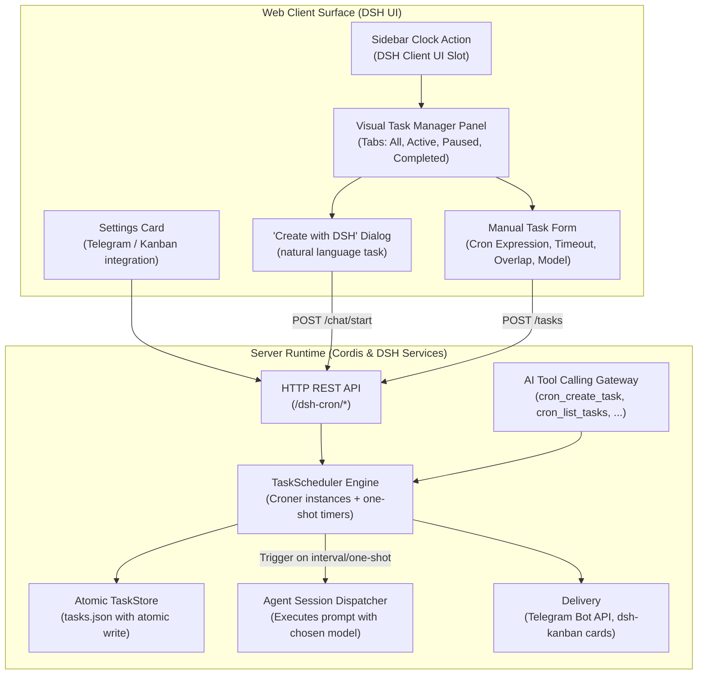

# 📦 @goodandready/dsh-cron

<div align="center">

<h3>Automated Cron Scheduling, Background Automation & Agent Execution Engine for DeepSeek Harness</h3>

<p align="center">
  <a href="https://www.npmjs.com/package/@goodandready/dsh-cron"></a>
  <a href="LICENSE"></a>
  <a href="https://github.com/topics/dsh-plugin"></a>
  <a href="https://nodejs.org"></a>
</p>

<p align="center">
  <a href="https://goodandready.app/"></a>
</p>

<p align="center">
  <a href="README.md"><b>🇬🇧 English</b></a> •
  <a href="docs/README.ru.md"><b>🇷🇺 Русский</b></a> •
  <a href="docs/README.zh.md"><b>🇨🇳 中文说明</b></a>
</p>

</div>

---

## ⚡ Overview & The Problem

Autonomous AI agents often need to perform recurring duties: generating daily morning digests, triaging bug trackers, checking API health, syncing databases, or running periodic Git hygiene. Without a dedicated scheduler inside the harness, users must rely on external crontab wrappers, complex webhook setups, or manual intervention.

**`@goodandready/dsh-cron`** is a native full-stack scheduling and background automation plugin for DeepSeek Harness. It bridges standard cron expressions and natural interval syntax with autonomous agent execution, providing:

1. **Rich Visual Task Manager** — a sidebar button and a full-featured panel to inspect, filter, pause, trigger, and create recurring tasks.
2. **Interactive "Create with DSH" Workflow** — chat with your agent to translate high-level requirements into a well-formed scheduled task.
3. **Autonomous AI Tool Calling** — native `cron_*` tools let agents schedule their own follow-up executions during conversations.
4. **Robust Scheduler & Atomic Storage** — built on `croner` with interval aliases, one-shot delays, atomic file persistence, run histories, and cost tracking.

---

## 🏗️ Architecture



---

## ✨ Features & Capabilities

### 1. Visual Task Manager & Sidebar Action
Click the clock icon in the DSH sidebar (positioned next to the new-session button) to open the management panel:
* **Status Filter Tabs**: toggle between **All**, **Active**, **Paused**, and **Completed** tasks.
* **Instant Action Menu**: trigger manual one-off executions (**Run Now**), pause/resume schedules, or delete obsolete tasks with a confirmation step.
* **1-Click Preset Templates**: scaffold common workflows like *Daily digest*, *Weekly review*, and *Follow-up monitor*.
* **Execution History**: open any task card to review previous runs — timestamps, durations, statuses (success / failed / timeout / skipped / missed), outputs, and errors.
* **Aggregated Stats Bar**: live dashboard with active task count, total runs, total token consumption, and the estimated dollar spend.

### 2. "Create with DSH" Dialog
Transform natural language into a scheduled job without guessing cron syntax:
1. Click **Create ⌄** ➔ **Create with DSH**.
2. Describe what you want to automate (e.g. *"Check open PRs every weekday at 9:00 and draft review comments"*).
3. The plugin spawns a dedicated agent session pre-injected with scheduler instructions. The agent clarifies the details with you — LLM vs no-LLM shell task, the exact cron expression, an economical model from those available in your DSH installation, and whether a "silent rule" (alert only on new events or failures) should apply — and registers the task through the `cron_create_task` tool only after your confirmation.

### 3. Agent Tools (Tool Calling)
Autonomous agents can manage schedules directly:

| Tool | Description |
|:---|:---|
| `cron_create_task` | Creates a scheduled task: `title`, `schedule`, `prompt`, optional `type` (`llm`/`script`), `delivery`, `provider`, `model`, `notifyTelegram`, `onlyOnFailure`, `timeoutSeconds`, `overlapPolicy`, `kanbanMode` |
| `cron_schedule_task` | Alias of `cron_create_task` kept for compatibility with existing agent prompts |
| `cron_list_tasks` | Lists tasks with statuses, next run timestamps, token totals, and cost estimates |
| `cron_pause_task` | Pauses a schedule without deleting its configuration |
| `cron_resume_task` | Resumes a paused schedule |
| `cron_delete_task` | Permanently removes a task and its history |
| `cron_run_task` | Triggers an immediate out-of-band run |

Example invocation the model can make during a conversation:

```
cron_create_task({
  "title": "Morning digest",
  "schedule": "0 8 * * 1-5",
  "prompt": "Prepare a brief morning digest of active tasks and open tickets.",
  "type": "llm",
  "delivery": "isolated"
})
```

### 4. Schedule Expression Syntax
Powered by `croner`, supporting standard 5-field cron expressions plus user-friendly aliases:

* `0 9 * * 1-5` — weekdays at 09:00
* `*/15 * * * *` — every 15 minutes
* `0 0 * * 0` — every Sunday at midnight
* `every 10m` / `every 2h` / `every 30s` — natural duration intervals
* `daily` / `hourly` / `weekdays` shortcuts, plus standard `@hourly` / `@daily` / `@weekly` / `@monthly` / `@yearly` and `@every 30m`
* **Per-task time zones** — set an IANA zone (e.g. `Europe/Berlin`) on a task; without it the schedule follows the server's local time
* **One-shot tasks**: `at: 2026-09-05T15:00:00Z` (exact ISO timestamp) or relative delays `in 20m` / `in 2h` (Russian aliases such as `через 15 минут` are accepted too). One-shot tasks flip to `completed` automatically after their single run and are listed under the **Completed** tab.

### 5. Execution Reliability
* **Automatic retries** — set `maxRetries` and a base `retryBackoffMs` per task; failed runs (`error`/`timeout`) are retried with exponential backoff, and the attempt counter resets on success.
* **Misfire policies** — choose per task what happens when the daemon was offline at a scheduled time: `skip` (default — record the gap), `runOnce` (execute once, late), or `catchUpAll` (run late and record the gap). A missed one-shot under `skip` is retired as `completed` instead of firing stale.
* **Concurrency limit** — `maxConcurrent` (plugin setting) caps parallel runs; extra runs are recorded as `skipped` with a reason.
* **Live execution indicator** — the task list shows a pulsing status icon and a running timer for the task in flight.

### 6. Session Integration & Permissions
* **Per-task permission presets** — `default`, `read-only`, `workspace-write`, or `full` are applied to the task's agent session before the prompt runs.
* **Session auto-archive** — isolated cron sessions are archived after each run (best-effort) so they do not clutter the chat list.
* **History → session navigation** — every LLM run records its session; open it straight from the run history entry.

### 5. Telegram Notifications & Delivery Routing
Direct integration with the Telegram Bot API delivers execution reports and error traces straight to your messenger:

* **Auto-detected or custom credentials** — enter a custom `botToken` and `chatId` in the settings dialog, or let the plugin inherit defaults from the `dsh-messenger-gateway` section of your DSH `settings.yaml` (best-effort fallback).
* **Only-on-failure mode** — enable `onlyOnFailure` globally or per task. Clean runs stay silent; failures (`error` or `timeout` statuses) dispatch an alert with the error trace.
* **Markdown formatting** — messages carry status badges (✅ / ❌), duration, schedule description, and monospace output blocks; dynamic values are escaped so odd titles cannot break the message.
* **Test dispatch button** — verify Telegram connectivity on the spot before scheduling critical jobs.

### 6. Kanban Integration & Cost Meter
* **Automatic Kanban cards** — with `kanbanMode` set to `on_failure` or `always`, the plugin creates cards in `dsh-kanban` (`on_failure` → *Backlog* on `error`/`timeout`; `always` → *Done*/*Backlog* on completion).
* **Token & execution cost meter** — token consumption (input, output, cache reads) is tracked per run and per task, with USD estimates from a built-in pricing table and an aggregated analytics bar.

### 7. Overlap Policies & Execution Timeout
Prevent rogue processes from stacking concurrent duplicate executions:

* **Execution timeout (`timeoutSeconds`)** — when the limit is reached, shell subprocesses are killed immediately via the abort signal and agent sessions are disposed so they stop consuming tokens. Default: `1800` (30 minutes).
* **Overlap policy (`overlapPolicy`)** — controls what happens when a tick fires while the previous run is still active:
  * **`skip`** (default): drops the overlapping run and records a `skipped` entry in the run history.
  * **`queue`**: queues the next execution and starts it as soon as the active job completes.
  * **`replace`**: aborts the active run via `AbortController` and launches a fresh execution.

If the daemon was offline at a scheduled time, the run is recorded as `missed` on startup, so gaps in the history stay visible.

### 8. Heartbeat Monitoring (#16-style dead man's switch)
* Set `heartbeatUrl` and `heartbeatIntervalSec` in the plugin settings and the scheduler pings that URL on schedule — an external monitor alerts when the pings stop.
* A built-in `GET /dsh-cron/heartbeat` endpoint reports liveness, active task count and the last run time for your own watchdogs.

---

## 📦 Installation

Install into your DeepSeek Harness web profile:

```bash
dsh plugin --profile web add @goodandready/dsh-cron
```

Restart your DeepSeek Harness instance and refresh the browser.

---

## ⚙️ Configuration (`settings.yaml`)

Configuration can be applied in `settings.yaml` or managed interactively via the plugin settings card in DSH:

```yaml
# settings.yaml
dsh-cron:
  botToken: ""                 # Telegram Bot API token (kept secret; see notes)
  chatId: ""                   # Telegram chat ID that receives reports
  notifyTelegram: false        # deliver reports for every task globally
  onlyOnFailure: false         # deliver reports only for failed runs
  kanbanBaseUrl: "http://127.0.0.1:3000"  # dsh-kanban HTTP API base URL
  defaultTimezone: ""          # default IANA time zone for schedules (empty = server local)
  maxConcurrent: 0             # max parallel task runs (0 = unlimited)
  heartbeatUrl: ""             # dead man's snitch URL pinged on the heartbeat interval
  heartbeatIntervalSec: 0      # heartbeat ping interval in seconds (0 = off)
```

### Configuration Parameters

| Parameter | Type | Default | Description |
|:---|:---|:---|:---|
| `botToken` | `string` | `""` | Telegram Bot API token. If left empty, the plugin tries to inherit the bot configured for `dsh-messenger-gateway` in the DSH settings as a best-effort fallback. Stored as a secret field; the UI only ever displays a masked value |
| `chatId` | `string` | `""` | Telegram chat ID that receives the reports. Empty value falls back to the first allowed chat of `dsh-messenger-gateway` |
| `notifyTelegram` | `boolean` | `false` | Global switch: deliver run reports to Telegram |
| `onlyOnFailure` | `boolean` | `false` | Global switch: deliver reports only for `error`/`timeout` runs |
| `kanbanBaseUrl` | `string` | `"http://127.0.0.1:3000"` | Base URL of the `dsh-kanban` HTTP API used for automatic card creation |
| `defaultTimezone` | `string` | `""` | Default IANA time zone for task schedules; empty = server local time |
| `maxConcurrent` | `number` | `0` | Cap on parallel task runs; extra runs are recorded as `skipped` (0 = unlimited) |
| `heartbeatUrl` | `string` | `""` | Dead man's snitch URL pinged every `heartbeatIntervalSec` while the scheduler is alive |
| `heartbeatIntervalSec` | `number` | `0` | Heartbeat ping interval in seconds (0 = disabled) |

Notes:

* Run history is capped at **50 entries per task** (fixed); each entry keeps up to 4000 characters of output.
* Tasks run in the **server's local timezone**; cron expressions are evaluated by `croner` on the host clock.
* Tasks persist in the DSH data directory (`cron/tasks.json`) and survive restarts; missed one-shots are detected on startup.

---

## 🔌 HTTP API Reference

All endpoints are served by the DSH web server under `/dsh-cron/`. Read endpoints are open to the local UI; **mutating endpoints reject cross-origin requests** and accept bodies up to 1 MB. Creating `script`-type tasks over HTTP additionally requires the `x-dsh-cron-confirm: script` header, which forged cross-site posts cannot attach.

| Method | Path | Description |
|:---|:---|:---|
| `GET` | `/dsh-cron/tasks` | List tasks; query params `status` (`all/active/paused/completed`), `query` (substring search). Returns tasks, recommendation templates and aggregated stats |
| `POST` | `/dsh-cron/tasks` | Create or update a task (`id` present → update). Requires `title`, `schedule`, `prompt` |
| `GET` | `/dsh-cron/tasks/:id/history` | Run history, `?limit=20` |
| `POST` | `/dsh-cron/tasks/:id/run` | Trigger an immediate manual run |
| `POST` | `/dsh-cron/tasks/:id/pause` | Pause the schedule |
| `POST` | `/dsh-cron/tasks/:id/resume` | Resume the schedule |
| `POST` | `/dsh-cron/tasks/:id/toggle` | Toggle active/paused |
| `PATCH` | `/dsh-cron/tasks/:id` | Partial update (whitelisted fields only: `title`, `schedule`, `prompt`, `type`, `delivery`, `provider`, `model`, notification/timeout/overlap/kanban settings, `status`, `oneShot`) |
| `DELETE` | `/dsh-cron/tasks/:id` | Delete the task |
| `GET` | `/dsh-cron/models` | List LLM providers; `?provider=<id>` lists models |
| `POST` | `/dsh-cron/chat/start` | Start a "Create with DSH" agent session with the task-setup instructions |
| `GET` | `/dsh-cron/settings` | Client-safe settings (token masked) |
| `POST` | `/dsh-cron/settings` | Update integration settings (applied through the settings service) |
| `GET` | `/dsh-cron/heartbeat` | Liveness probe: active task count, last run time, server time |
| `POST` | `/dsh-cron/telegram/test` | Send a Telegram test message |
| `POST` | `/dsh-cron/kanban/test` | Create a Kanban connectivity-test card |
| `*` | `/dsh-cron/action/:id/:action` | Legacy alias for the task action routes (`run`, `toggle`, `delete`, `history`) |

---

## 🧪 Testing

Run the automated test suite covering schedule parsing, the scheduler engine, atomic storage, HTTP helpers, notifications and tool contracts:

```bash
npm test
```

---

## 📄 License

MIT © [GooDAnDReaDY](https://github.com/GooDAnDReaDY)
