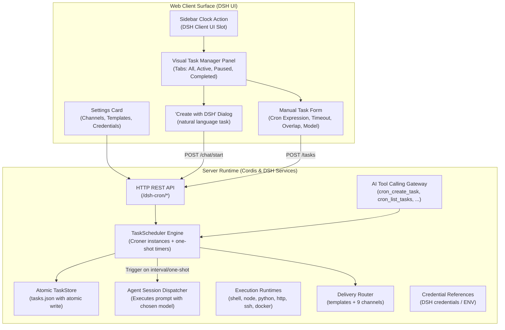

# 📦 @goodandready/dsh-cron

<div align="center">

<h3>Automated Cron Scheduling, Background Automation & Agent Execution Engine for DeepSeek Harness</h3>

<p align="center">
  <a href="https://www.npmjs.com/package/@goodandready/dsh-cron"></a>
  <a href="LICENSE"></a>
  <a href="https://github.com/topics/dsh-plugin"></a>
  <a href="https://nodejs.org"></a>
</p>

<p align="center">
  <a href="https://goodandready.app/"></a>
</p>

<p align="center">
  <a href="README.md"><b>🇬🇧 English</b></a> •
  <a href="docs/README.ru.md"><b>🇷🇺 Русский</b></a> •
  <a href="docs/README.zh.md"><b>🇨🇳 中文说明</b></a>
</p>

</div>

---

## ⚡ Overview & The Problem

Autonomous AI agents often need to perform recurring duties: generating daily morning digests, triaging bug trackers, checking API health, syncing databases, or running periodic Git hygiene. Without a dedicated scheduler inside the harness, users must rely on external crontab wrappers, complex webhook setups, or manual intervention.

**`@goodandready/dsh-cron`** is a native full-stack scheduling and background automation plugin for DeepSeek Harness. It bridges standard cron expressions and natural interval syntax with autonomous agent execution, providing:

1. **Rich Visual Task Manager** — a sidebar button with a collapsible list of active jobs (next run or live state, capped and persisted), plus a full panel to inspect, filter by type/model/channel, pause, trigger, duplicate, export/import and create tasks.
2. **Interactive "Create with DSH" Workflow** — chat with your agent to translate high-level requirements into a well-formed scheduled task.
3. **Autonomous AI Tool Calling** — native `cron_*` tools let agents schedule their own follow-up executions during conversations.
4. **Robust Scheduler & Atomic Storage** — built on `croner` with interval aliases, one-shot delays, atomic file persistence, run histories, and cost tracking.
5. **Six Execution Runtimes** — shell, Node.js, Python, HTTP/webhook, remote SSH and Docker, plus per-task environment variables, workspace binding and isolated git worktrees for code-modifying agent tasks.
6. **Multi-Channel Delivery With Templates** — one run fans out to Telegram, dsh-kanban, Discord, Slack, ntfy, Bark, PushPlus, voice (`dsh-tts`) and Gitea, with `{variable}` message templates and secrets referenced by DSH credential name.

---

## 🏗️ Architecture



---

## ✨ Features & Capabilities

### 1. Visual Task Manager & Sidebar Action
Click the clock icon in the DSH sidebar (positioned next to the new-session button) to open the management panel:
* **Status Filter Tabs**: toggle between **All**, **Active**, **Paused**, and **Completed** tasks.
* **Instant Action Menu**: trigger manual one-off executions (**Run Now**), pause/resume schedules, or delete obsolete tasks with a confirmation step.
* **1-Click Preset Templates**: scaffold common workflows like *Daily digest*, *Weekly review*, and *Follow-up monitor*.
* **Execution History**: open any task card to review previous runs — timestamps, durations, statuses (success / failed / timeout / skipped / missed), outputs, and errors.
* **Aggregated Stats Bar**: live dashboard with active task count, total runs, total token consumption, and the estimated dollar spend.

### 2. "Create with DSH" Dialog
Transform natural language into a scheduled job without guessing cron syntax:
1. Click **Create ⌄** ➔ **Create with DSH**.
2. Describe what you want to automate (e.g. *"Check open PRs every weekday at 9:00 and draft review comments"*).
3. The plugin spawns a dedicated agent session pre-injected with scheduler instructions. The agent clarifies the details with you — LLM vs no-LLM shell task, the exact cron expression, an economical model from those available in your DSH installation, and whether a "silent rule" (alert only on new events or failures) should apply — and registers the task through the `cron_create_task` tool only after your confirmation.

### 3. Agent Tools (Tool Calling)
Autonomous agents can manage schedules directly:

| Tool | Description |
|:---|:---|
| `cron_create_task` | Creates a scheduled task: `title`, `schedule`, `prompt`, `fallbackModel` (one retry on a stronger model when a run fails), optional `type` (`llm`/`script`/`node`/`python`/`http`/`ssh`/`docker`/`skill`/`workflow`), `delivery`, `provider`, `model`, `channels`, `template`, `notifyTelegram`, `onlyOnFailure`, `timeoutSeconds`, `overlapPolicy`, `kanbanMode` |
| `cron_schedule_task` | Alias of `cron_create_task` kept for compatibility with existing agent prompts |
| `cron_list_tasks` | Lists tasks with statuses, next run timestamps, token totals, and cost estimates |
| `cron_pause_task` | Pauses a schedule without deleting its configuration |
| `cron_resume_task` | Resumes a paused schedule |
| `cron_delete_task` | Permanently removes a task and its history |
| `cron_run_task` | Triggers an immediate out-of-band run |
| `cron_get_task` | Reads the full configuration of one task, including fields the list does not show |
| `cron_update_task` | Changes an existing task in place (whitelisted fields, same validation as the HTTP route); the model is told to confirm code-executing changes with the user first |

Example invocation the model can make during a conversation:

```
cron_create_task({
  "title": "Morning digest",
  "schedule": "0 8 * * 1-5",
  "prompt": "Prepare a brief morning digest of active tasks and open tickets.",
  "type": "llm",
  "delivery": "isolated"
})
```

### 4. Schedule Expression Syntax
Powered by `croner`, supporting standard 5-field cron expressions plus user-friendly aliases:

* `0 9 * * 1-5` — weekdays at 09:00
* `*/15 * * * *` — every 15 minutes
* `0 0 * * 0` — every Sunday at midnight
* `every 10m` / `every 2h` / `every 30s` — natural duration intervals
* `daily` / `hourly` / `weekdays` shortcuts, plus standard `@hourly` / `@daily` / `@weekly` / `@monthly` / `@yearly` and `@every 30m`
* **Per-task time zones** — set an IANA zone (e.g. `Europe/Berlin`) on a task; without it the schedule follows the server's local time
* **One-shot tasks**: `at: 2026-09-05T15:00:00Z` (exact ISO timestamp) or relative delays `in 20m` / `in 2h` (Russian aliases such as `через 15 минут` are accepted too). One-shot tasks flip to `completed` automatically after their single run and are listed under the **Completed** tab.

### 5. Execution Reliability
* **Automatic retries** — set `maxRetries` and a base `retryBackoffMs` per task; failed runs (`error`/`timeout`) are retried with exponential backoff, and the attempt counter resets on success.
* **Misfire policies** — choose per task what happens when the daemon was offline at a scheduled time: `skip` (default — record the gap), `runOnce` (execute once, late), or `catchUpAll` (run late and record the gap). A missed one-shot under `skip` is retired as `completed` instead of firing stale.
* **Concurrency limit** — `maxConcurrent` (plugin setting) caps parallel runs; extra runs are recorded as `skipped` with a reason.
* **Live execution indicator** — the task list shows a pulsing status icon and a running timer for the task in flight.

### 6. Execution Runtimes
Every task picks its own runtime; non-LLM runtimes need no model and consume no tokens:

* **Shell** (`script`) — command or script through the harness shell, with `env` and `cwd`.
* **Node.js** (`node`) and **Python** (`python`) — run a snippet with an explicit interpreter path (`nodePath`, `pythonPath`); Python detects a project virtualenv.
* **HTTP** (`http`) — GET/POST/… to a URL with custom headers and body, and the response status/output recorded in the run history.
* **SSH** (`ssh`) — execute a command on a remote host through a `dsh-remote-workspace` profile (`sshProfileId`) or standalone host/key fields.
* **Docker** (`docker`) — run the command in a container image (`dockerImage`).
* **Environment variables** — a per-task `env` map (KEY VALUE per line in the UI) applied to external runtimes; secrets do not belong here.
* **Workspaces and worktrees** — bind a task to a harness workspace (`workspaceId`) and, for code-modifying agent tasks, run it in an isolated git worktree (`worktree`, `keepWorktree`).

### 7. Cost Control: Fallback Model
A task can run on the cheap model by default and still finish on the strong one: set `fallbackModel` (and optionally `fallbackProvider`) and a failed run — `error` or `timeout` — is retried **once** on that model before the ordinary retry backoff applies. History records which model produced the result and whether the fallback was used, usage and cost of both attempts are summed, and the `{model}` template variable renders the model that finished the run. Only agent-mediated tasks (`llm`, `skill`, `workflow`) can use a fallback.

### 8. Session Integration & Permissions
* **Per-task permission presets** — `default`, `read-only`, `workspace-write`, or `full` are applied to the task's agent session before the prompt runs.
* **Session auto-archive** — isolated cron sessions are archived after each run (best-effort) so they do not clutter the chat list.
* **History → session navigation** — every LLM run records its session; open it straight from the run history entry.

### 9. Quiet by Rule
A task with output can carry a **silent rule** written in plain words ("stay silent when no filesystem is above 80%"). On a successful run a cheap model judges the output against that rule and the report is skipped when the verdict is to stay silent, with the reason recorded in the run history. It fails open: no rule, no model, a failed call or an unreadable answer all mean the report is delivered. `silentRuleModel` (plugin setting) picks the model used for the judgement.

### 10. Failure Diagnosis
Agent tasks can ask for a diagnosis: with `inspectOnFailure` set, a failed run (`error` or `timeout`) is read by a model together with the task prompt and truncated output, and the run history stores a short diagnosis plus a concrete prompt change. The history entry offers to load that suggestion into the edit form — nothing is applied automatically. The model is configurable with `inspectorModel`, and `{diagnosis}` is available in message templates. A broken or unavailable model call leaves the failed run exactly as it was.

### 11. Notification Channels & Message Templates
A finished run is delivered to every channel configured for the task — Telegram, dsh-kanban, Discord, Slack, ntfy, Bark, PushPlus, voice via `dsh-tts`, and Gitea issues:

* **Per-task channels** — tick the channels in the task form; an explicit selection overrides the legacy `notifyTelegram` / `kanbanMode` switches, and an empty selection falls back to them.
* **Failure isolation** — one unreachable channel is reported in the scheduler log with the other channels still delivered; a broken webhook never swallows the rest of the report.
* **Message templates** — a global template, per-channel overrides, or a per-task template rendered from `{title} {id} {status} {output} {error} {duration} {schedule} {time} {tokens} {cost}`. Unknown placeholders are left intact, failed runs default to a failure template.
* **`onlyOnFailure`** — globally or per task, clean runs stay silent and only `error`/`timeout` runs are dispatched.
* **Credentials by reference** — webhook tokens and the Telegram bot token are entered as the NAME of a DSH credential (`botTokenRef`, `ntfyTokenRef`, `pushplusTokenRef`, `giteaTokenRef`); the value is resolved at send time through the DSH credentials service with an environment-variable fallback, and never travels through plugin settings. Webhook URLs and the Bark device key do embed a secret, so they are stored in the plugin settings file but are always returned masked to the browser and a masked value echoed back by the UI never overwrites the stored one.
* **Delivery timeout** — every channel request is bounded (`deliveryTimeoutMs`, default 15000 ms, editable in the settings panel or `settings.yaml`) and channels are dispatched concurrently, so one unresponsive endpoint is recorded as a failure and cannot delay the other channels or the next scheduled tick. The bound is enforced around the whole channel handler, which also covers credential resolution, which does not support abort signals.
* **Telegram** — Markdown report with status badges (✅ / ❌), duration, schedule description and monospace output; dynamic values are escaped so odd titles cannot break the message. Credentials may be entered directly, or inherited from the `dsh-messenger-gateway` section of your DSH `settings.yaml` (best-effort fallback).
* **Discord / Slack** — webhook delivery; Discord carries an embed coloured by run status, Slack a plain text body.
* **ntfy / Bark / PushPlus** — mobile push with a topic/device key and an optional bearer token; the Bark title and text travel in the request path.
* **Voice** — `dsh-tts` speaks the report through its HTTP route (`ttsBaseUrl`, default `http://127.0.0.1:3080`).
* **Gitea** — opens an issue with the run report (`giteaBaseUrl`, `giteaRepo`, token credential); failures are labelled `cron`, `bug`, `alert`.
* **Test dispatch button** — verify Telegram connectivity on the spot before scheduling critical jobs.

### 12. Kanban Integration & Cost Meter
* **Automatic Kanban cards** — with `kanbanMode` set to `on_failure` or `always`, the plugin creates cards in `dsh-kanban` (`on_failure` → *Backlog* on `error`/`timeout`; `always` → *Done*/*Backlog* on completion).
* **Token & execution cost meter** — token consumption (input, output, cache reads) is tracked per run and per task, with USD estimates from a built-in pricing table and an aggregated analytics bar.

### 13. Overlap Policies & Execution Timeout
Prevent rogue processes from stacking concurrent duplicate executions:

* **Execution timeout (`timeoutSeconds`)** — when the limit is reached, shell subprocesses are killed immediately via the abort signal and agent sessions are disposed so they stop consuming tokens. Default: `1800` (30 minutes).
* **Overlap policy (`overlapPolicy`)** — controls what happens when a tick fires while the previous run is still active:
  * **`skip`** (default): drops the overlapping run and records a `skipped` entry in the run history.
  * **`queue`**: queues the next execution and starts it as soon as the active job completes.
  * **`replace`**: aborts the active run via `AbortController` and launches a fresh execution.

If the daemon was offline at a scheduled time, the run is recorded as `missed` on startup, so gaps in the history stay visible.

### 14. Heartbeat Monitoring (#16-style dead man's switch)
* Set `heartbeatUrl` and `heartbeatIntervalSec` in the plugin settings and the scheduler pings that URL on schedule — an external monitor alerts when the pings stop.
* A built-in `GET /dsh-cron/heartbeat` endpoint reports liveness, active task count and the last run time for your own watchdogs.

### 15. Declarative Jobs From the Profile Config (#50)
Long-lived operational jobs can be declared in the profile configuration instead of being recreated by hand in the UI. The config file owns the jobs it declares: at every plugin start they are created or updated, and a job that disappears from the file is removed.

Add a `jobs` list to the plugin section of your profile config (`cordis.patch.yml`):

```yaml
dsh-cron:
  jobs:
    - id: nightly-backup
      title: Nightly backup
      schedule: "0 3 * * *"
      type: script
      prompt: "bash /path/to/backup.sh"
      channels: ["telegram"]
      timeoutSeconds: 3600
    - id: morning-digest
      title: Morning digest
      schedule: "0 8 * * 1-5"
      type: llm
      prompt: "Prepare a brief morning digest of active tasks."
      provider: my-provider
      model: provider-id/model-id
```

* Required per entry: `id`, `title`, `schedule`; the types that carry their payload in the prompt (`script`, `node`, `python`, `ssh`, `docker`, `llm`, `skill`, `workflow`) also need a non-empty `prompt`. `http` is exempt: its target is given by `httpUrl` (or `prompt`).
* Any other task field is passed through with the same validation as the API: `channels`, `model`, `provider`, `fallbackModel`, `silentRule`, `inspectOnFailure`, `timezone`, `timeoutSeconds`, `template`, `env`, `cwd`, and the runtime fields (`nodePath`, `pythonPath`, `httpUrl`, `httpMethod`, `httpHeaders`, `httpBody`, `sshProfileId`, `sshTarget`, `dockerImage`, `workspaceId`, `worktree`, `keepWorktree`, `skillName`, `workflowName`).
* Declared jobs are marked **managed by the config**; the panel shows a source label instead of edit and delete actions.
* Editing, pausing, resuming, toggling or deleting a config-owned task is refused with `409` on the panel and on the API, and a create-or-update `POST /dsh-cron/tasks` that carries the existing `id` of a config-owned task is refused the same way — the config file is the source of truth. **Run Now** stays available.
* A task with the same `id` created through the UI, the API or an agent tool is never overwritten: the entry is skipped and the conflict is written to the log.
* Code-executing types are activated like any other declared job, but at startup the plugin writes a warning to the log, so a code path introduced through the config file is visible.
* Entries are validated one by one with an indexed message (`config.jobs[i]: …`); a broken entry is skipped and cannot stop the remaining jobs or the profile.

### 16. External REST API (`/dsh-cron/api/*`, #54)
External systems (CI, host cron, `curl`) can drive the scheduler without opening the browser panel. This is the only surface behind a bearer token; the panel routes stay local and cross-origin-protected.

Set the token as the plugin setting `apiToken` (masked like every secret). Auth and errors:
* no token configured → the whole surface answers `503`;
* a missing or wrong `Authorization: Bearer <token>` → `401`, compared in constant time.

| Method | Path | Description |
|:---|:---|:---|
| `GET` | `/dsh-cron/api/tasks` | List tasks (`status` / `query` filters as the panel) |
| `GET` | `/dsh-cron/api/tasks/:id` | Read one task |
| `POST` | `/dsh-cron/api/tasks` | Create a task, or update the existing one when `id` is present |
| `DELETE` | `/dsh-cron/api/tasks/:id` | Delete a task |
| `POST` | `/dsh-cron/api/tasks/:id/run` | Force an immediate run |

The operations reuse the panel handlers, so the `x-dsh-cron-confirm: script` gate for code-executing types and the `409` refusals for config-owned tasks behave exactly as in the UI.

```bash
BASE="http://127.0.0.1:3080"
TOKEN="<API_TOKEN>"

# list
curl -s -H "Authorization: Bearer $TOKEN" "$BASE/dsh-cron/api/tasks"

# create, or update when the body carries the id
curl -s -X POST -H "Authorization: Bearer $TOKEN" -H "Content-Type: application/json" \
  -d '{"id":"cleanup","title":"Cleanup","schedule":"0 4 * * *","prompt":"Remove stale temporary files."}' \
  "$BASE/dsh-cron/api/tasks"

# force a run
curl -s -X POST -H "Authorization: Bearer $TOKEN" "$BASE/dsh-cron/api/tasks/cleanup/run"

# delete
curl -s -X DELETE -H "Authorization: Bearer $TOKEN" "$BASE/dsh-cron/api/tasks/cleanup"

# a code-executing task also needs the confirmation header
curl -s -X POST -H "Authorization: Bearer $TOKEN" -H "x-dsh-cron-confirm: script" \
  -H "Content-Type: application/json" \
  -d '{"title":"Disk check","schedule":"0 * * * *","type":"script","prompt":"df -h"}' \
  "$BASE/dsh-cron/api/tasks"
```

### 17. Prometheus Metrics (#53)
`GET /dsh-cron/metrics` returns Prometheus text exposition, so the scheduler can be scraped without any extra dependency:

* `dsh_cron_tasks_total{status}` — tasks by status (gauge).
* `dsh_cron_task_last_duration_seconds{task}` — duration of a task's last finished run, in seconds (gauge).
* `dsh_cron_runs_total{status}` — finished runs since the plugin process started (counter); the statuses are `success`, `error`, `timeout`, `skipped` and `missed`.
* `dsh_cron_run_records` — run records currently kept in memory (gauge).

Only counts, statuses and durations are exported; prompts, run output and task configuration never appear in the exposition.

```yaml
scrape_configs:
  - job_name: dsh-cron
    static_configs:
      - targets: ["127.0.0.1:3080"]
    metrics_path: /dsh-cron/metrics
```

### 18. Strict Channel Validation (#121)
Creating or updating a task with an unknown delivery-channel id is now rejected with `400`, and the offending ids are listed:

```json
{ "ok": false, "error": "Unknown channel ids: email_ping", "unknownChannels": ["email_ping"] }
```

Changed in v0.2.7: previously an unknown id was silently dropped, so a client with a typo received `ok: true` and ended up with a task that delivered nowhere.

Import deliberately stays tolerant (a file may come from an older build): unknown ids are dropped from the imported task, but they are named in the response (`unknownChannels`) and written to the scheduler log instead of disappearing silently.

### 19. Post-Install Verification (#126)
`deploy.sh` has a verify-only mode that inspects an already installed profile without installing anything:

```bash
bash deploy.sh verify [exact-version]
```

It checks that the profile reports the requested version (default: the `package.json` version), authenticates to the web UI, then downloads the client bundle and confirms the package name is present.

Why it is needed: the web profile can sit behind an authentication plugin and answer `401` to an anonymous request, and a plugin client bundle is served only through the exact combined `??` URL printed in the authenticated index — a bare `/plugins/<name>/client.js` answers `404`. The check therefore builds an authenticated session first.

Environment used by the check: `DSH_WEB_BASE` (default `http://127.0.0.1:3080`), `DSH_WEB_TOKEN` (the token; when unset, the script reads the last one printed to the unit journal), `DSH_WEB_UNIT` (default `dsh-web.service`). No secret is stored in the script.

### 20. Internal Refactor: Schedule Parsing and Arming (#97)
Developer-facing, no behaviour change. `parseScheduleExpression` was split into small functions that keep the same branch order — `parseAtExpression`, `parseRelativeOneShot`, `parseIntervalExpression`, `parseAliasExpression`, `parseCronExpression` — and `scheduleTask` into `clearScheduled`, `scheduleOneShot` and `scheduleCron`. The existing test suite passed unchanged and targeted tests were added for branch precedence and error messages.

### 21. Performance & Process Isolation Pack (Added in v0.2.9, #134)
- **Process-Tree Termination**: Shell and script tasks run in an isolated process group (`detached: true` on POSIX); aborts and timeouts send `SIGTERM` followed by `SIGKILL` to the entire group (`-child.pid`) to eliminate orphan and zombie processes.
- **Concurrency Throttling**: Default safe limit `maxConcurrent = 2` prevents CPU and memory spikes during overlapping scheduled runs.
- **Transient Error Retry**: Exponential backoff retry (up to 3 attempts) for transient network and provider errors (`429`, `502`, `503`, `504`, `ECONNRESET`).
- **Network & UI Optimization**: `GET /dsh-cron/tasks` provides `ETag` and responds with `304 Not Modified`; client UI adapts polling frequency (`visibilitychange`: 30s in background tabs, 8s in active tabs).
- **History Rotation & Archival**: Active store holds the latest 100 runs per task; older entries are automatically archived into `tasks-history-archive.json`.
- **Autonomous PR Reviewer Recipe (#33)**: Preconfigured recipe in Template Hub with optional toggle `prReviewerEnabled` in settings.

---

## 📦 Installation

Install into your DeepSeek Harness web profile:

```bash
dsh plugin --profile web add @goodandready/dsh-cron
```

Restart your DeepSeek Harness instance and refresh the browser.

---

## ⚙️ Configuration (`settings.yaml`)

Configuration can be applied in `settings.yaml` or managed interactively via the plugin settings card in DSH:

```yaml
# settings.yaml
dsh-cron:
  botToken: ""                 # Telegram Bot API token (kept secret; see notes)
  chatId: ""                   # Telegram chat ID that receives reports
  notifyTelegram: false        # deliver reports for every task globally
  onlyOnFailure: false         # deliver reports only for failed runs
  kanbanBaseUrl: "http://127.0.0.1:3000"  # dsh-kanban HTTP API base URL
  defaultTimezone: ""          # default IANA time zone for schedules (empty = server local)
  maxConcurrent: 0             # max parallel task runs (0 = unlimited)
  heartbeatUrl: ""             # dead man's snitch URL pinged on the heartbeat interval
  heartbeatIntervalSec: 0      # heartbeat ping interval in seconds (0 = off)
  # --- delivery channels ---
  botTokenRef: ""              # credential NAME for the Telegram bot token
  template: ""                 # global message template, e.g. "⏰ {title} — {status}"
  channelTemplates: {}         # per-channel template overrides keyed by channel id
  deliveryTimeoutMs: 15000     # per-channel delivery timeout; slow channel = failure, others unaffected
  discordWebhookUrl: ""        # Discord webhook
  slackWebhookUrl: ""          # Slack incoming webhook
  ntfyUrl: "https://ntfy.sh"   # ntfy server; ntfyTopic / ntfyTokenRef
  ntfyTopic: ""
  ntfyTokenRef: ""
  barkServerUrl: "https://api.day.app"  # Bark server; barkKey = device key
  barkKey: ""
  pushplusUrl: "https://www.pushplus.plus/send"  # pushplusTokenRef
  pushplusTokenRef: ""
  ttsBaseUrl: "http://127.0.0.1:3080"   # dsh-tts base URL
  giteaBaseUrl: ""             # giteaRepo = owner/repo, giteaTokenRef = credential NAME
  giteaRepo: ""
  giteaTokenRef: ""
  # --- external REST API (#54) ---
  apiToken: ""                 # bearer token for the external /dsh-cron/api/* surface (masked; empty = 503)
```

### Configuration Parameters

| Parameter | Type | Default | Description |
|:---|:---|:---|:---|
| `botToken` | `string` | `""` | Telegram Bot API token. If left empty, the plugin tries to inherit the bot configured for `dsh-messenger-gateway` in the DSH settings as a best-effort fallback. Stored as a secret field; the UI only ever displays a masked value |
| `chatId` | `string` | `""` | Telegram chat ID that receives the reports. Empty value falls back to the first allowed chat of `dsh-messenger-gateway` |
| `notifyTelegram` | `boolean` | `false` | Global switch: deliver run reports to Telegram |
| `onlyOnFailure` | `boolean` | `false` | Global switch: deliver reports only for `error`/`timeout` runs |
| `kanbanBaseUrl` | `string` | `"http://127.0.0.1:3000"` | Base URL of the `dsh-kanban` HTTP API used for automatic card creation |
| `defaultTimezone` | `string` | `""` | Default IANA time zone for task schedules; empty = server local time |
| `maxConcurrent` | `number` | `0` | Cap on parallel task runs; extra runs are recorded as `skipped` (0 = unlimited) |
| `heartbeatUrl` | `string` | `""` | Dead man's snitch URL pinged every `heartbeatIntervalSec` while the scheduler is alive |
| `heartbeatIntervalSec` | `number` | `0` | Heartbeat ping interval in seconds (0 = disabled) |
| `botTokenRef` | `string` | `""` | Name of the DSH credential holding the Telegram bot token; resolved at send time (falls back to `botToken`, then the messenger-gateway settings, then the `CRON_TELEGRAM_BOT_TOKEN` environment variable) |
| `template` | `string` | `""` | Global message template with `{title}`/`{status}`/`{duration}`/… placeholders; empty = built-in text |
| `channelTemplates` | `object` | `{}` | Per-channel template overrides keyed by channel id (`telegram`, `discord`, …) |
| `deliveryTimeoutMs` | `number` | `15000` | Per-channel delivery timeout; a slower endpoint is recorded as a delivery failure and does not delay the other channels or the next tick |
| `discordWebhookUrl` / `slackWebhookUrl` | `string` | `""` | Webhook URLs for the Discord and Slack channels |
| `ntfyUrl` / `ntfyTopic` / `ntfyTokenRef` | `string` | `"https://ntfy.sh"` / `""` / `""` | ntfy server, topic and an optional token credential name (sent as `Authorization: Bearer …`) |
| `barkServerUrl` / `barkKey` | `string` | `"https://api.day.app"` / `""` | Bark server and device key (key, title and text travel in the request path) |
| `pushplusUrl` / `pushplusTokenRef` | `string` | `"https://www.pushplus.plus/send"` / `""` | PushPlus endpoint (override for a self-hosted proxy) and token credential name |
| `ttsBaseUrl` | `string` | `"http://127.0.0.1:3080"` | Base URL of the `dsh-tts` plugin used for voice announcements |
| `giteaBaseUrl` / `giteaRepo` / `giteaTokenRef` | `string` | `""` | Gitea channel: base URL, `owner/repo`, and the credential name of the API token |
| `apiToken` | `string` | `""` | Bearer token for the external `/dsh-cron/api/*` surface. Stored as a secret field and returned masked; empty disables the surface (503), a wrong value answers 401 |

Notes:

* Run history is capped at **50 entries per task** (fixed); each entry keeps up to 4000 characters of output.
* Tasks run in the **server's local timezone**; cron expressions are evaluated by `croner` on the host clock.
* Tasks persist in the DSH data directory (`cron/tasks.json`) and survive restarts; missed one-shots are detected on startup.

---

## 🔌 HTTP API Reference

All endpoints are served by the DSH web server under `/dsh-cron/`. Read endpoints are open to the local UI; **mutating endpoints reject cross-origin requests** and accept bodies up to 1 MB. Creating `script`-type tasks over HTTP additionally requires the `x-dsh-cron-confirm: script` header, which forged cross-site posts cannot attach.

| Method | Path | Description |
|:---|:---|:---|
| `GET` | `/dsh-cron/tasks` | List tasks; query params `status` (`all/active/paused/completed`), `query` (substring search). Returns tasks, recommendation templates and aggregated stats |
| `POST` | `/dsh-cron/tasks` | Create or update a task (`id` present → update). Requires `title`, `schedule`, `prompt` |
| `GET` | `/dsh-cron/tasks/:id/history` | Run history, `?limit=20` |
| `POST` | `/dsh-cron/tasks/:id/run` | Trigger an immediate manual run |
| `POST` | `/dsh-cron/tasks/:id/pause` | Pause the schedule |
| `POST` | `/dsh-cron/tasks/:id/resume` | Resume the schedule |
| `POST` | `/dsh-cron/tasks/:id/toggle` | Toggle active/paused |
| `POST` | `/dsh-cron/tasks/:id/duplicate` | Creates a paused copy of a task: configuration copied, run state (history, counters, last run) reset |
| `GET` | `/dsh-cron/recipes` | Built-in recipe catalog: ready-to-use monitoring presets grouped by category, all read-only |
| `GET` | `/dsh-cron/tasks/export` | Versioned JSON document with task configuration only — no history or counters. Channels reference credentials by name, but a task-level `env` map or HTTP headers you typed in yourself are part of the configuration and therefore appear in the file |
| `POST` | `/dsh-cron/tasks/import` | Validates a document and applies it with `add`, `replace` or `skip`; supports a `dryRun` summary. Imported tasks always start **paused**, so a restore never fires until reviewed |
| `PATCH` | `/dsh-cron/tasks/:id` | Partial update (whitelisted fields only: `title`, `schedule`, `prompt`, `type`, `delivery`, `provider`, `model`, runtime settings, `channels`, `template`, notification/timeout/overlap/kanban settings, `status`, `oneShot`) |
| `DELETE` | `/dsh-cron/tasks/:id` | Delete the task |
| `GET` | `/dsh-cron/models` | List LLM providers; `?provider=<id>` lists models |
| `POST` | `/dsh-cron/chat/start` | Start a "Create with DSH" agent session with the task-setup instructions |
| `GET` | `/dsh-cron/settings` | Client-safe settings (token masked) |
| `POST` | `/dsh-cron/settings` | Update integration settings (applied through the settings service) |
| `GET` | `/dsh-cron/heartbeat` | Liveness probe: active task count, last run time, server time |
| `POST` | `/dsh-cron/telegram/test` | Send a Telegram test message |
| `POST` | `/dsh-cron/kanban/test` | Create a Kanban connectivity-test card |
| `*` | `/dsh-cron/action/:id/:action` | Legacy alias for the task action routes (`run`, `toggle`, `delete`, `history`) |
| `GET` | `/dsh-cron/metrics` | Prometheus text exposition of task and run counters — never prompts or output (#53) |
| `GET` / `POST` | `/dsh-cron/api/tasks` | External token-guarded surface: list / create-or-update (#54) |
| `GET` / `DELETE` | `/dsh-cron/api/tasks/:id` | External token-guarded surface: read / delete (#54) |
| `POST` | `/dsh-cron/api/tasks/:id/run` | External token-guarded surface: force a run (#54) |

---

## 🧪 Testing

Run the automated test suite covering schedule parsing, the scheduler engine, atomic storage, HTTP helpers, notifications and tool contracts:

```bash
npm test
```

---

## 📄 License

MIT © [GooDAnDReaDY](https://github.com/GooDAnDReaDY)
