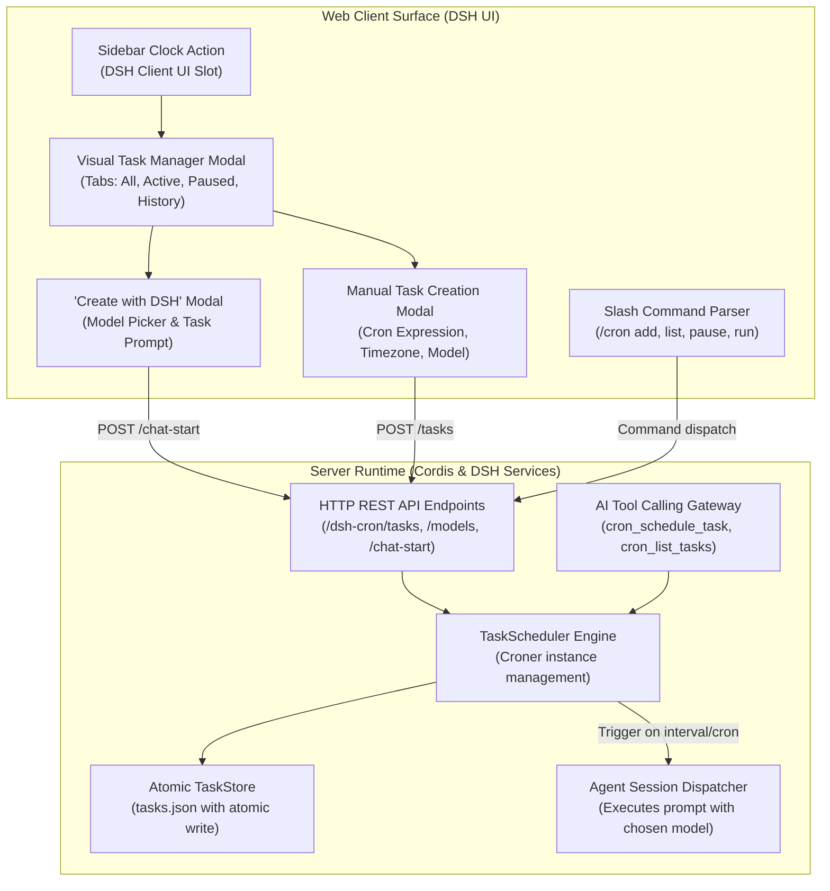

# 📦 @goodandready/dsh-cron

<div align="center">

<h3>Automated Cron Scheduling, Background Automation & Agent Execution Engine for DeepSeek Harness</h3>

<p align="center">
  <a href="https://www.npmjs.com/package/@goodandready/dsh-cron"></a>
  <a href="LICENSE"></a>
  <a href="https://github.com/topics/dsh-plugin"></a>
  <a href="https://nodejs.org"></a>
</p>

<p align="center">
  <a href="https://goodandready.app/"></a>
</p>

<p align="center">
  <a href="README.md"><b>🇬🇧 English</b></a> •
  <a href="docs/README.ru.md"><b>🇷🇺 Русский</b></a> •
  <a href="docs/README.zh.md"><b>🇨🇳 中文说明</b></a>
</p>

</div>

---

## ⚡ Overview & The Problem

Autonomous AI agents often need to perform recurring duties: generating daily morning digests, triaging bug trackers, checking API health, syncing databases, or running periodic Git hygiene. Without a dedicated scheduler inside the harness, users must rely on external crontab wrappers, complex webhook setups, or manual intervention.

**`@goodandready/dsh-cron`** is a native full-stack scheduling and background automation plugin for DeepSeek Harness. It bridges standard cron expressions and natural interval syntax with autonomous agent execution, providing:

1. **Rich Visual Task Manager**: A dedicated sidebar navigation button and full-featured visual overlay to inspect, filter, pause, trigger, and create recurring tasks.
2. **Interactive "Create with DSH" Workflow**: Chat directly with your agent to translate high-level requirements into scheduled tasks, complete with custom model selection and prompt synthesis.
3. **Chat Slash Commands (`/cron`)**: Fast command-line control directly from the chat prompt (`/cron list`, `/cron add`, `/cron pause`, `/cron run`).
4. **Autonomous AI Tool Calling**: Gives agents native tools (`cron_schedule_task`, `cron_list_tasks`, `cron_toggle_task`) so they can schedule their own follow-up executions during conversations.
5. **Robust Scheduler & Atomic Storage**: Built on `croner` with timezone support, interval aliases (`every 15m`, `daily`, `weekdays`), atomic file persistence, and run execution histories.

---

## 🏗️ Architecture



---

## ✨ Features & Capabilities

### 1. Visual Task Manager & Sidebar Action
Click the clock icon in the DSH sidebar (positioned conveniently next to Kanban and Chat) to open the management overlay:
* **Status Filter Tabs**: Seamlessly toggle between **All**, **Active**, **Paused**, and **Completed** tasks.
* **Instant Action Menu**: Trigger manual one-off executions (`Run Now`), pause/resume intervals, or delete obsolete schedules with confirmation safeguards.
* **1-Click Preset Templates**: Quickly scaffold common workflows like *Daily Development Digest*, *Weekly Repo Review*, and *Health Heartbeat*.
* **Execution History**: Expand any task card to review previous execution timestamps, elapsed durations, exit statuses, and generated outputs.

### 2. "Create with DSH" AI Chat Modal
Transform natural language into scheduled jobs without manually guessing cron expressions:
1. Click **Create ⌄** ➔ **Create with DSH**.
2. Select your target AI provider and model from the live model dropdown.
3. Describe what you want the agent to automate (e.g. *"Check open PRs every weekday at 9:00 AM and draft review comments"*).
4. The plugin automatically spawns a dedicated agent session pre-injected with scheduler system instructions to formulate the task and register it into `TaskStore`.

### 3. Chat Slash Command (`/cron`)
For keyboard-first workflows, manage tasks directly inside the chat window:

| Command | Syntax | Description |
|:---|:---|:---|
| `/cron list` | `/cron list` | Lists all registered tasks with IDs, schedules, and active statuses |
| `/cron add` | `/cron add "<schedule>" <prompt>` | Creates a task. Example: `/cron add "every 2h" Run git fetch and summarize changes` |
| `/cron pause` | `/cron pause <id>` | Pauses a running schedule without deleting its configuration |
| `/cron resume` | `/cron resume <id>` | Resumes a previously paused task schedule |
| `/cron run` | `/cron run <id>` | Triggers immediate out-of-band execution of the task |
| `/cron delete` | `/cron delete <id>` | Permanently removes the task from the schedule |

### 4. Agent Tools (Tool Calling)
When autonomous agents need to set up delayed or recurring actions, they can invoke these tools:

* **`cron_schedule_task`**: Schedules a recurring or interval-based task with `name`, `schedule`, `prompt`, and optional `model` override.
* **`cron_list_tasks`**: Retrieves an overview of active schedules and next scheduled run timestamps.
* **`cron_toggle_task`**: Enables or disables an existing task by `id`.

### 6. Telegram Notifications & Delivery Routing
Direct integration with the Telegram Bot API delivers execution reports and error traces straight to your messenger:

* **Auto-Detected or Custom Credentials**: Enter a custom `botToken` and `chatId` in the UI settings dialog, or automatically inherit default credentials from `dsh-messenger-gateway` in `settings.yaml`.
* **'Only on Failure' Mode (Issue #24)**: Prevent notification spam by enabling `onlyOnFailure` globally or on individual tasks. Clean runs remain silent, while non-zero exit codes or agent exceptions immediately dispatch an alert with stdout/stderr traces.
* **Markdown Formatting**: Messages are formatted with status badges (✅ / ❌), execution duration in milliseconds, schedule descriptions, and monospace code blocks.
* **Test Dispatch Button**: Verify Telegram connectivity on the spot before scheduling critical production jobs.

### 7. Overlap Policies & Execution Timeout Control (Issues #11, #17)
Prevent rogue processes from consuming server resources or stacking concurrent duplicate executions:

* **Execution Timeout (`timeoutSeconds`)**: Automatically cancels agent sessions or kills shell subprocesses when the configured run time limit is reached (default: 1800s / 30m). Prevents hung tasks and records a descriptive timeout failure in run logs.
* **Overlap Policy (`overlapPolicy`)**: Controls scheduler behavior when a scheduled tick fires while the previous execution is still running:
  * **`skip`** (default): Drops the overlapping run and records a `skipped` status entry in the run history without spamming.
  * **`queue`**: Queues the next execution and starts it automatically as soon as the active job completes.
  * **`replace`**: Aborts the stuck/active run immediately via `AbortController` and launches the fresh execution.

### 5. Schedule Expression Syntax
Powered by `croner`, supporting both standard 5-part/6-part cron expressions and user-friendly interval aliases:

* `0 9 * * 1-5` — Every weekday at 09:00 AM
* `*/15 * * * *` — Every 15 minutes
* `0 0 * * 0` — Every Sunday at midnight
* `every 10m` / `every 2h` / `every 30s` — Natural duration intervals
* `daily` / `hourly` / `weekly` — Standard predefined shortcuts

---

## 📦 Installation

Install into your DeepSeek Harness web profile:

```bash
dsh plugin --profile web add @goodandready/dsh-cron
```

Restart your DeepSeek Harness instance and refresh the browser.

---

## ⚙️ Configuration (`settings.yaml`)

Configuration can be applied in `settings.yaml` or managed interactively via the DSH Settings UI:

```yaml
# settings.yaml
dsh-cron:
  storagePath: "data/cron-tasks.json"
  maxHistoryEntries: 50
  defaultTimezone: "UTC"
  defaultModel: ""
  notifyOnFailure: true
```

### Configuration Parameters

| Parameter | Type | Default | Description |
|:---|:---|:---|:---|
| `storagePath` | `string` | `"data/cron-tasks.json"` | Relative or absolute path where scheduled tasks and run histories are persisted atomically |
| `maxHistoryEntries` | `number` | `50` | Maximum number of run history records preserved per task card |
| `defaultTimezone` | `string` | `"UTC"` | Default IANA timezone used for cron calculations (e.g., `"Europe/Berlin"`, `"America/New_York"`) |
| `defaultModel` | `string` | `""` | Fallback model identifier for tasks created without an explicit model selection |
| `notifyOnFailure` | `boolean` | `true` | Emits a notification badge in the UI if a scheduled background task encounters a failure |

---

## 🧪 Testing

Run the automated test suite covering schedulers, atomic storage, and HTTP handlers:

```bash
npm test
```

---

## 📄 License

MIT © [GooDAnDReaDY](https://github.com/GooDAnDReaDY)

### Kanban & Token Cost Integration (v0.1.17)
- **Automatic Kanban Card Creation**: Automatically creates task/bug cards in `dsh-kanban` on task failure (`on_failure`) or every run (`always`).
- **Token & Execution Cost Meter**: Tracks token consumption (input, output, cache tokens) for LLM executions and estimates USD expenses using current model pricing.
- **Aggregated Analytics Bar**: Live dashboard displaying active jobs count, total executions, total token consumption, and aggregate estimated dollar spend.

### One-Shot Delayed Tasks (v0.1.18)
- **Precise Timing & Relative Delays**: Supports one-time tasks triggered at exact ISO 8601 timestamps (`at: 2026-09-05T12:00:00Z`) or human-friendly relative delays (`in 20m`, `in 2h`, `через 15 минут`).
- **Auto-Completion Lifecycle**: One-shot jobs transition automatically to `completed` status after their single run, preventing unexpected repeats.
- **Dedicated Filter**: View historical and pending one-shot executions under the «Completed» (`completed`) tab.
