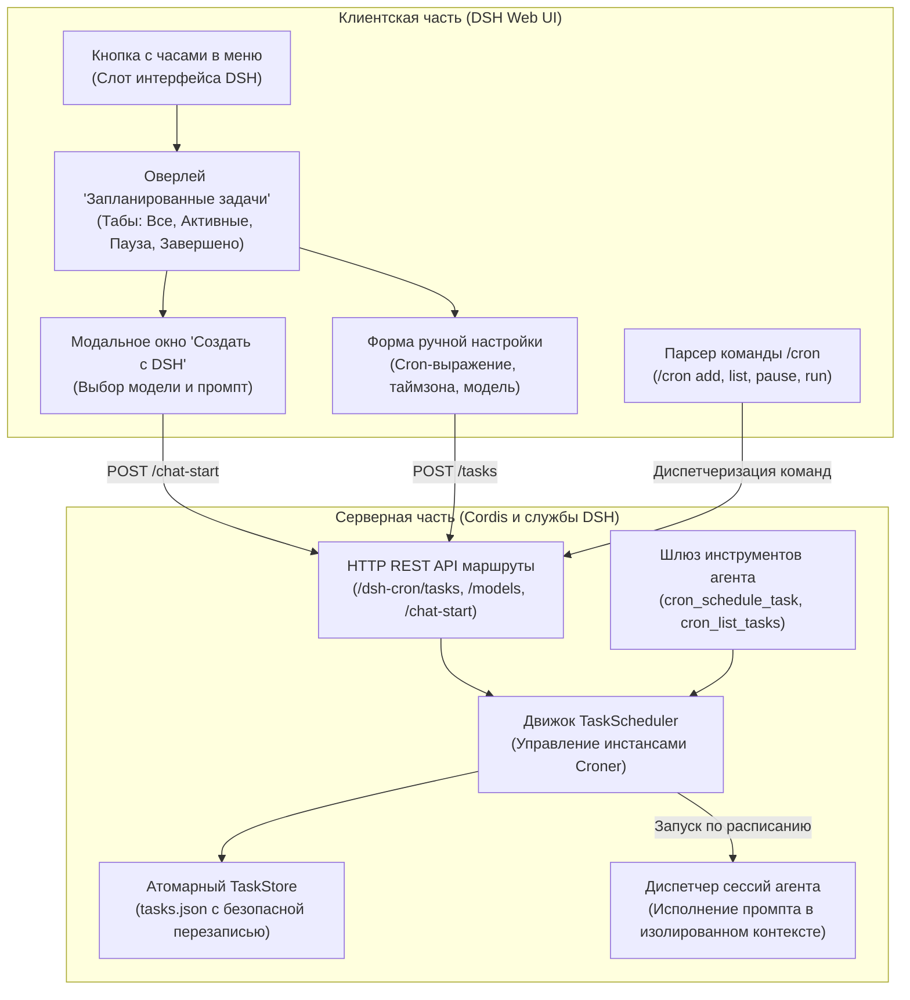

# 📦 @goodandready/dsh-cron

<div align="center">

<h3>Планировщик фоновых задач, cron-автоматизация и выполнение сценариев агентом для DeepSeek Harness</h3>

<p align="center">
  <a href="https://www.npmjs.com/package/@goodandready/dsh-cron"></a>
  <a href="LICENSE"></a>
  <a href="https://github.com/topics/dsh-plugin"></a>
  <a href="https://nodejs.org"></a>
</p>

<p align="center">
  <a href="https://goodandready.app/"></a>
</p>

<p align="center">
  <a href="../README.md"><b>🇬🇧 English</b></a> •
  <a href="README.ru.md"><b>🇷🇺 Русский</b></a> •
  <a href="README.zh.md"><b>🇨🇳 中文说明</b></a>
</p>

</div>

---

## ⚡ Назначение и решаемая проблема

При повседневной работе автономные ИИ-агенты часто должны выполнять повторяющиеся рутинные обязанности: собирать утренние сводки изменений, мониторить статус открытых пулл-реквестов, проверять работоспособность внешних API, проводить регулярную очистку кэша или запускать сценарии тестирования. Без встроенного планировщика пользователю приходится настраивать внешние утилиты crontab, сложные вебхуки или вручную запускать нужные команды каждый день.

**`@goodandready/dsh-cron`** — полнофункциональный плагин планировщика и фоновой автоматизации для DeepSeek Harness. Он объединяет стандартные cron-выражения и удобные человекопонятные интервалы с автономным запуском агентских сессий:

1. **Визуальный интерфейс «Запланированные задачи»**: удобная кнопка с часами в боковом меню DSH (рядом с канбан-доской и чатом) и полноэкранный интерфейс со вкладками фильтрации, историей запусков и ручным управлением.
2. **Интерактивный диалог «Создать с DSH»**: постановка задач агенту на естественном языке с автоматическим формированием cron-расписания и выбором рабочей языковой модели.
3. **Команда `/cron` прямо в чате**: быстрое управление задачами с клавиатуры (`/cron list`, `/cron add`, `/cron pause`, `/cron run`).
4. **Инструменты модели (AI Tool Calling)**: агент может самостоятельно планировать свои будущие действия в ходе выполнения задачи через встроенные инструменты (`cron_schedule_task`, `cron_list_tasks`, `cron_toggle_task`).
5. **Надёжный движок и атомарное хранение**: построен на библиотеке `croner`, поддерживает таймзоны, интервалы (`every 15m`, `daily`, `weekdays`), атомарную запись JSON-хранилища и историю выполнения.

---

## 🏗️ Архитектура работы



---

## ✨ Подробный разбор возможностей

### 1. Графический оверлей и кнопка в боковом меню
По клику на значок часов в боковой панели DSH открывается удобный центр управления:
* **Табы статусов**: быстрое переключение между категориями **Все**, **Активные**, **Приостановленные** и **Завершено**.
* **Меню быстрых действий**: мгновенный запуск вне очереди (*«Запустить сейчас»*), постановка на паузу/возобновление и безопасное удаление задач.
* **Готовые шаблоны в 1 клик**: предустановленные карточки популярных сценариев (*«Ежедневная сводка изменений»*, *«Еженедельный обзор репозитория»*, *«Мониторинг доступности»*).
* **Журнал истории**: в карточке каждой задачи сохраняются отметки времени запуска, длительность работы в секундах, статус завершения и логи агента.

### 2. Режим создания «Создать с DSH»
Позволяет формулировать периодические задачи на обычном разговорном языке:
1. Нажмите **Создать ⌄** ➔ **Создать с DSH**.
2. Выберите нужного провайдера и модель из выпадающего списка.
3. Опишите задачу (например: *«Каждое утро в 9:00 проверять открытые тикеты в Gitea и формировать краткий дайджест»*).
4. Плагин автоматически создаст отдельную диалоговую сессию с агентом, передаст системные инструкции планировщика и зарегистрирует задачу в `TaskStore`.

### 3. Команда `/cron` в строке ввода чата
Для тех, кто предпочитает работу с клавиатуры:

| Команда | Синтаксис | Описание |
|:---|:---|:---|
| `/cron list` | `/cron list` | Выводит список всех зарегистрированных задач со статусами и ID |
| `/cron add` | `/cron add "<расписание>" <промпт>` | Создаёт новую задачу. Пример: `/cron add "every 2h" Собрать статистику коммитов` |
| `/cron pause` | `/cron pause <id>` | Приостанавливает выполнение задачи без её удаления |
| `/cron resume` | `/cron resume <id>` | Возобновляет работу приостановленной задачи |
| `/cron run` | `/cron run <id>` | Немедленно запускает задачу вне очереди |
| `/cron delete` | `/cron delete <id>` | Полностью удаляет задачу из расписания |

### 4. Инструменты модели (Tool Calling)
Агент может вызывать инструменты планировщика в процессе общения:

* **`cron_schedule_task`**: создание задачи с параметрами `name`, `schedule`, `prompt` и опциональным выбором `model`.
* **`cron_list_tasks`**: просмотр списка запланированных задач и времени их следующего срабатывания.
* **`cron_toggle_task`**: включение или выключение задачи по её идентификатору `id`.

### 5. Поддерживаемый синтаксис расписаний
Благодаря библиотеке `croner` поддерживаются как классические cron-выражения, так и дружественные интервалы:

* `0 9 * * 1-5` — по будням в 09:00 утра
* `*/15 * * * *` — каждые 15 минут
* `0 0 * * 0` — каждое воскресенье в полночь
* `every 10m` / `every 2h` / `every 30s` — интервалы на понятном языке
* `daily` / `hourly` / `weekly` — быстрые алиасы

---

## 📦 Установка

Установка через командную строку DeepSeek Harness:

```bash
dsh plugin --profile web add @goodandready/dsh-cron
```

Перезапустите DSH и обновите вкладку в браузере.

---

## ⚙️ Конфигурация (`settings.yaml`)

Настройка доступна через файл конфигурации или панель настроек DSH:

```yaml
# settings.yaml
dsh-cron:
  storagePath: "data/cron-tasks.json"
  maxHistoryEntries: 50
  defaultTimezone: "Europe/Moscow"
  defaultModel: ""
  notifyOnFailure: true
```

### Таблица параметров конфигурации

| Параметр | Тип | По умолчанию | Описание |
|:---|:---|:---|:---|
| `storagePath` | `string` | `"data/cron-tasks.json"` | Путь к файлу атомарного сохранения задач и истории |
| `maxHistoryEntries` | `number` | `50` | Максимальное количество записей журнала запусков на задачу |
| `defaultTimezone` | `string` | `"UTC"` | Часовой пояс IANA для расчёта cron-выражений |
| `defaultModel` | `string` | `""` | Модель по умолчанию, если не выбрана вручную |
| `notifyOnFailure` | `boolean` | `true` | Показывать уведомление в интерфейсе при сбое фоновой задачи |

---

## 🧪 Тестирование

Запуск набора юнит-тестов:

```bash
npm test
```

---

## 📄 Лицензия

MIT © [GooDAnDReaDY](https://github.com/GooDAnDReaDY)
