# 📦 @goodandready/dsh-cron

<div align="center">

<h3>Планировщик cron-задач, фоновая автоматизация и выполнение сценариев агентом для DeepSeek Harness</h3>

<p align="center">
  <a href="https://www.npmjs.com/package/@goodandready/dsh-cron"></a>
  <a href="../LICENSE"></a>
  <a href="https://github.com/topics/dsh-plugin"></a>
  <a href="https://nodejs.org"></a>
</p>

<p align="center">
  <a href="https://goodandready.app/"></a>
</p>

<p align="center">
  <a href="../README.md"><b>🇬🇧 English</b></a> •
  <a href="README.ru.md"><b>🇷🇺 Русский</b></a> •
  <a href="README.zh.md"><b>🇨🇳 中文说明</b></a>
</p>

</div>

---

## ⚡ Обзор и проблема

Автономным AI-агентам регулярно нужны повторяющиеся действия: утренние сводки, разбор трекеров задач, проверка доступности API, синхронизация баз данных, периодическая гигиена Git. Без штатного планировщика внутри харнесса приходится использовать внешние обёртки над crontab, сложные webhook-схемы или ручной запуск.

**`@goodandready/dsh-cron`** — нативный полноформатный плагин планирования и фоновой автоматизации для DeepSeek Harness. Он связывает стандартные cron-выражения и естественные интервалы с автономным исполнением агентами:

1. **Развитый визуальный менеджер задач** — кнопка в сайдбаре и полноценная панель: просмотр, фильтры, пауза, немедленный запуск, создание задач.
2. **Интерактивный сценарий «Создать с DSH»** — опишите задачу словами, агент уточнит детали и оформит расписание.
3. **Автономный tool calling** — нативные инструменты `cron_*` позволяют агентам планировать собственные последующие действия прямо в диалоге.
4. **Надёжный планировщик и атомарное хранилище** — на базе `croner`: интервалы, разовые задачи с задержкой, атомарная запись, история запусков, учёт стоимости.
5. **Шесть рантаймов исполнения** — shell, Node.js, Python, HTTP/webhook, удалённый SSH и Docker, плюс переменные окружения на задачу, привязка workspace и изолированные git worktree для изменяющих код агентских задач.
6. **Многоканальная доставка с шаблонами** — один запуск расходится в Telegram, dsh-kanban, Discord, Slack, ntfy, Bark, PushPlus, email, голос (`dsh-tts`) и Gitea, с шаблонами сообщений `{переменные}` и секретами по имени credential в DSH.

---

## 🏗️ Архитектура

```mermaid
graph TD
    subgraph Client ["Клиентская поверхность (DSH UI)"]
        SidebarBtn["Кнопка-часы в сайдбаре<br/>(слот DSH Client UI)"]
        Overlay["Панель управления задачами<br/>(табы: Все, Активные, На паузе, Завершённые)"]
        CreateWithDSH["Диалог «Создать с DSH»<br/>(задача на естественном языке)"]
        ManualForm["Ручная форма задачи<br/>(рантайм, cron, таймаут, overlap, каналы)"]
        SettingsCard["Карточка настроек<br/>(каналы, шаблоны, credentials)"]
    end

    subgraph Server ["Серверная часть (Cordis и сервисы DSH)"]
        HttpRoutes["HTTP REST API<br/>(/dsh-cron/*)"]
        AgentTools["Шлюз tool calling<br/>(cron_create_task, cron_list_tasks, ...)"]
        Scheduler["Движок TaskScheduler<br/>(экземпляры Croner + таймеры one-shot)"]
        Store["Атомарный TaskStore<br/>(tasks.json, атомарная запись)"]
        AgentRunner["Диспетчер агентских сессий<br/>(запуск промпта выбранной моделью)"]
        Runtimes["Рантаймы исполнения<br/>(shell, node, python, http, ssh, docker)"]
        Notify["Маршрутизатор доставки<br/>(шаблоны + 10 каналов)"]
        Secrets["Credential-ссылки<br/>(DSH credentials / ENV)"]
    end

    SidebarBtn --> Overlay
    Overlay --> CreateWithDSH
    Overlay --> ManualForm
    SettingsCard --> HttpRoutes
    CreateWithDSH -->|POST /chat/start| HttpRoutes
    ManualForm -->|POST /tasks| HttpRoutes
    HttpRoutes --> Scheduler
    AgentTools --> Scheduler
    Scheduler --> Store
    Scheduler -->|Запуск по интервалу/one-shot| AgentRunner
    Scheduler --> Notify
```



---

## ✨ Возможности

### 1. Визуальный менеджер задач
Нажмите на иконку-часы в сайдбаре DSH (рядом с кнопкой новой сессии), чтобы открыть панель:
* **Табы фильтрации**: **Все**, **Активные**, **На паузе**, **Завершённые**.
* **Мгновенные действия**: немедленный запуск (**Запустить**), пауза/возобновление расписания, удаление с подтверждением.
* **Готовые шаблоны в один клик**: *Ежедневная сводка*, *Еженедельный обзор*, *Мониторинг дальнейших действий*.
* **История запусков**: в карточке задачи — время, длительность и статусы предыдущих запусков (успех / сбой / таймаут / пропуск / пропущен по простою), вывод и ошибки.
* **Сводная статистика**: активные задачи, всего запусков, израсходованные токены и оценочная стоимость в долларах.

### 2. Диалог «Создать с DSH»
Превратите естественный язык в задачу без подбора cron-синтаксиса:
1. Нажмите **Создать ⌄** ➔ **Создать с DSH**.
2. Опишите, что нужно автоматизировать (например: *«Проверяй открытые PR по будням в 9:00 и готовь черновики комментариев»*).
3. Плагин создаст отдельную агентскую сессию с системными инструкциями планировщика. Агент уточнит детали — LLM или NO-LLM shell-задача, точное cron-выражение, экономичная модель из доступных в вашей установке DSH, нужно ли «правило тишины» (алерт только при новых событиях или сбоях) — и создаст задачу через инструмент `cron_create_task` только после вашего подтверждения.

### 3. Инструменты агентов (tool calling)

| Инструмент | Описание |
|:---|:---|
| `cron_create_task` | Создаёт задачу: `title`, `schedule`, `prompt`, опционально `type` (`llm`/`script`/`node`/`python`/`http`/`ssh`/`docker`/`skill`/`workflow`), `delivery`, `provider`, `model`, `channels`, `template`, `notifyTelegram`, `onlyOnFailure`, `timeoutSeconds`, `overlapPolicy`, `kanbanMode` |
| `cron_schedule_task` | Псевдоним `cron_create_task` для совместимости с существующими промптами |
| `cron_list_tasks` | Список задач со статусами, временем следующего запуска, токенами и стоимостью |
| `cron_pause_task` | Приостанавливает расписание без удаления конфигурации |
| `cron_resume_task` | Возобновляет приостановленное расписание |
| `cron_delete_task` | Полностью удаляет задачу и её историю |
| `cron_run_task` | Немедленный внеплановый запуск |

Пример вызова модели в диалоге:

```
cron_create_task({
  "title": "Утренняя сводка",
  "schedule": "0 8 * * 1-5",
  "prompt": "Подготовь короткую утреннюю сводку активных задач и открытых тикетов.",
  "type": "llm",
  "delivery": "isolated"
})
```

### 4. Синтаксис расписаний
На базе `croner`: стандартные 5-полевые cron-выражения и дружелюбные алиасы:

* `0 9 * * 1-5` — по будням в 09:00
* `*/15 * * * *` — каждые 15 минут
* `0 0 * * 0` — каждое воскресенье в полночь
* `every 10m` / `every 2h` / `every 30s` — естественные интервалы
* алиасы `daily` / `hourly` / `weekdays`, а также стандартные `@hourly` / `@daily` / `@weekly` / `@monthly` / `@yearly` и `@every 30m`
* **Часовые пояса** — для задачи можно указать IANA-зону (например, `Europe/Berlin`); без неё расписание живёт в серверном времени
* **Разовые задачи**: `at: 2026-09-05T15:00:00Z` (точный ISO-таймстемп) или относительные задержки `in 20m` / `in 2h` (принимаются и русские варианты вроде `через 15 минут`). После единственного запуска задача автоматически переходит в `completed` и отображается на табе **Завершённые**.

### 5. Надёжность исполнения
* **Автоповторы** — `maxRetries` и база `retryBackoffMs` на задачу: упавшие запуски (error/timeout) повторяются с экспоненциальной задержкой, счётчик сбрасывается после успеха.
* **Misfire-политики** — что делать с пропущенным за время простоя запуском: `skip` (по умолчанию — записать пропуск), `runOnce` (выполнить один раз с опозданием) или `catchUpAll` (выполнить и зафиксировать пропуск). Пропущенный one-shot при `skip` уходит в `completed` без выполнения.
* **Лимит параллельности** — настройка `maxConcurrent` ограничивает число одновременных запусков; лишние помечаются `skipped` с причиной.
* **Живой индикатор** — в списке задач пульсирует статус и идёт таймер текущего запуска.

### 6. Рантаймы исполнения
Каждая задача выбирает собственный рантайм; не-LLM рантаймы не используют модель и не тратят токены:

* **Shell** (`script`) — команда или скрипт через shell харнесса, с `env` и `cwd`.
* **Node.js** (`node`) и **Python** (`python`) — запуск сниппета с указанием интерпретатора (`nodePath`, `pythonPath`); для Python определяется виртуальное окружение проекта.
* **HTTP** (`http`) — GET/POST/… по URL с собственными заголовками и телом; статус и вывод ответа попадают в историю запуска.
* **SSH** (`ssh`) — выполнение команды на удалённом хосте через профиль `dsh-remote-workspace` (`sshProfileId`) или отдельные поля host/key.
* **Docker** (`docker`) — выполнение команды в контейнере образа (`dockerImage`).
* **Переменные окружения** — карта `env` на задачу (в UI — строки KEY VALUE) для внешних рантаймов; секретам здесь не место.
* **Workspace и worktree** — привязка задачи к workspace харнесса (`workspaceId`) и, для изменяющих код агентских задач, запуск в изолированном git worktree (`worktree`, `keepWorktree`).

### 7. Интеграция сессий и права
* **Permission-пресеты на задачу** — `default`, `read-only`, `workspace-write` или `full` применяются к сессии агента перед запуском промпта.
* **Автоархивация сессий** — изолированные cron-сессии архивируются после запуска (best-effort), не засоряя список чатов.
* **История → сессия** — каждый LLM-запуск хранит свою сессию; открыть диалог можно прямо из записи истории.

### 8. Каналы доставки и шаблоны сообщений
Отчёт о завершённом запуске уходит во все каналы, выбранные для задачи — Telegram, dsh-kanban, Discord, Slack, ntfy, Bark, PushPlus, email (SMTP), голос через `dsh-tts` и issue в Gitea:

* **Каналы на задачу** — отметьте каналы в форме задачи; явный выбор перекрывает legacy-переключатели `notifyTelegram`/`kanbanMode`, а пустой выбор возвращается к ним.
* **Изоляция сбоев** — недоступный канал фиксируется в логе планировщика, остальные каналы получают отчёт; сломанный webhook не поглощает доставку целиком.
* **Шаблоны сообщений** — глобальный шаблон, переопределения по каналам или шаблон на задачу с переменными `{title} {id} {status} {output} {error} {duration} {schedule} {time} {tokens} {cost}`. Неизвестные плейсхолдеры остаются как есть, для сбойных запусков по умолчанию используется шаблон ошибки.
* **`onlyOnFailure`** — глобально или на задачу: успешные запуски молчат, уходят только `error`/`timeout`.
* **Креденшелы по ссылке** — токены webhook'ов, пароль SMTP и токен Telegram вводятся как ИМЯ credential в DSH (`botTokenRef`, `ntfyTokenRef`, `pushplusTokenRef`, `smtpPasswordRef`, `giteaTokenRef`); значение резолвится в момент отправки через credentials-сервис DSH с фолбэком на переменную окружения. Секрет не хранится в файле настроек.
* **Telegram** — Markdown-отчёт со статусными значками (✅ / ❌), длительностью, описанием расписания и monospace-блоком вывода; динамические значения экранируются. Креденшелы можно ввести напрямую или унаследовать из секции `dsh-messenger-gateway` вашего DSH `settings.yaml` (best-effort).
* **Discord / Slack** — доставка через webhook: Discord получает embed с цветом по статусу запуска, Slack — обычный текст.
* **ntfy / Bark / PushPlus** — мобильные пуши: тема/ключ устройства и опциональный bearer-токен; у Bark заголовок и текст идут в пути запроса, у PushPlus endpoint настраивается (self-hosted прокси).
* **Email** — SMTP с хостом, портом, TLS, пользователем, `smtpFrom` и списком получателей; требует `nodemailer` в рантайме харнесса и сообщает понятную ошибку, если его нет.
* **Голос** — `dsh-tts` озвучивает отчёт через свой HTTP-маршрут (`ttsBaseUrl`, по умолчанию `http://127.0.0.1:3080`).
* **Gitea** — создаёт issue с отчётом (`giteaBaseUrl`, `giteaRepo`, credential токена); сбойные запуски помечаются метками `cron`, `bug`, `alert`.
* **Кнопка проверки** — проверьте доставку в Telegram до запуска критичных задач.

### 9. Интеграция с Kanban и учёт стоимости
* **Автоматические карточки Kanban** — при `kanbanMode` = `on_failure` или `always` плагин создаёт карточки в `dsh-kanban` (`on_failure` → *Backlog* при `error`/`timeout`; `always` → *Done*/*Backlog* по завершении).
* **Счётчик токенов и стоимости** — потребление токенов (ввод, вывод, чтения из кэша) учитывается по запускам и задачам с оценкой в USD по встроенной таблице цен и сводной панелью аналитики.

### 10. Политики наложения и таймаут выполнения

* **Таймаут (`timeoutSeconds`)** — по достижении лимита shell-процесс немедленно завершается через abort-сигнал, а агентская сессия закрывается, чтобы не расходовать токены. По умолчанию `1800` (30 минут).
* **Политика наложения (`overlapPolicy`)** — что делать, когда тик срабатывает при ещё активном предыдущем запуске:
  * **`skip`** (по умолчанию): накладывающийся запуск отбрасывается, в истории появляется запись `skipped`;
  * **`queue`**: следующий запуск ставится в очередь и стартует по завершении активного;
  * **`replace`**: активный запуск прерывается через `AbortController`, запускается свежий.

Если сервис был выключен в момент планового запуска, при старте в истории появится запись `missed` — пробелы в истории остаются видимыми.

---

## 📦 Установка

```bash
dsh plugin --profile web add @goodandready/dsh-cron
```

Перезапустите DeepSeek Harness и обновите страницу в браузере.

---

## ⚙️ Конфигурация (`settings.yaml`)

Конфигурацию можно задать в `settings.yaml` или интерактивно через карточку настроек плагина в DSH:

```yaml
# settings.yaml
dsh-cron:
  botToken: ""                 # токен Telegram Bot API (секретное поле)
  chatId: ""                   # ID чата Telegram для отчётов
  notifyTelegram: false        # глобально отправлять отчёты о всех задачах
  onlyOnFailure: false         # отправлять отчёты только при сбоях
  kanbanBaseUrl: "http://127.0.0.1:3000"  # базовый URL HTTP API dsh-kanban
  defaultTimezone: ""          # IANA-зона по умолчанию (пусто = серверное время)
  maxConcurrent: 0             # максимум параллельных запусков (0 = без лимита)
  heartbeatUrl: ""             # URL dead man's snitch, пингуется по интервалу
  heartbeatIntervalSec: 0      # интервал heartbeat-пинга в секундах (0 = выключено)
  # --- каналы доставки ---
  botTokenRef: ""              # ИМЯ credential для токена Telegram-бота
  template: ""                 # глобальный шаблон сообщения, напр. "⏰ {title} — {status}"
  channelTemplates: {}         # переопределения шаблонов по каналам
  discordWebhookUrl: ""        # webhook Discord
  slackWebhookUrl: ""          # incoming webhook Slack
  ntfyUrl: "https://ntfy.sh"   # сервер ntfy; ntfyTopic / ntfyTokenRef
  ntfyTopic: ""
  ntfyTokenRef: ""
  barkServerUrl: "https://api.day.app"  # сервер Bark; barkKey — ключ устройства
  barkKey: ""
  pushplusUrl: "https://www.pushplus.plus/send"  # pushplusTokenRef
  pushplusTokenRef: ""
  smtpHost: ""                 # smtpPort / smtpSecure / smtpUser / smtpFrom / smtpTo
  smtpPort: 587
  smtpSecure: false
  smtpUser: ""
  smtpPasswordRef: ""          # ИМЯ credential для пароля SMTP
  smtpFrom: ""
  smtpTo: ""
  ttsBaseUrl: "http://127.0.0.1:3080"   # базовый URL dsh-tts
  giteaBaseUrl: ""             # giteaRepo = owner/repo, giteaTokenRef = ИМЯ credential
  giteaRepo: ""
  giteaTokenRef: ""
```

### Параметры

| Параметр | Тип | По умолчанию | Описание |
|:---|:---|:---|:---|
| `botToken` | `string` | `""` | Токен Telegram Bot API. Если пусто, плагин пытается унаследовать бота, настроенного для `dsh-messenger-gateway` в настройках DSH (best-effort). Секретное поле: в интерфейсе отображается только замаскированное значение |
| `chatId` | `string` | `""` | ID чата Telegram для отчётов. Пустое значение — откат к первому разрешённому чату `dsh-messenger-gateway` |
| `notifyTelegram` | `boolean` | `false` | Глобальный выключатель доставки отчётов в Telegram |
| `onlyOnFailure` | `boolean` | `false` | Глобальный режим «только при сбоях» (`error`/`timeout`) |
| `kanbanBaseUrl` | `string` | `"http://127.0.0.1:3000"` | Базовый URL HTTP API `dsh-kanban` для автоматических карточек |
| `defaultTimezone` | `string` | `""` | IANA-зона по умолчанию для расписаний; пусто = серверное время |
| `maxConcurrent` | `number` | `0` | Лимит параллельных запусков; лишние помечаются `skipped` (0 = без лимита) |
| `heartbeatUrl` | `string` | `""` | URL dead man's snitch, пингуемый каждый `heartbeatIntervalSec`, пока жив планировщик |
| `heartbeatIntervalSec` | `number` | `0` | Интервал heartbeat-пинга в секундах (0 = выключено) |
| `botTokenRef` | `string` | `""` | Имя credential DSH с токеном Telegram-бота; резолвится при отправке (фолбэк: `botToken` → настройки messenger-gateway → переменная окружения `CRON_TELEGRAM_BOT_TOKEN`) |
| `template` | `string` | `""` | Глобальный шаблон сообщения с плейсхолдерами `{title}`/`{status}`/`{duration}`/…; пусто = встроенный текст |
| `channelTemplates` | `object` | `{}` | Переопределения шаблонов по каналам (`telegram`, `discord`, …) |
| `discordWebhookUrl` / `slackWebhookUrl` | `string` | `""` | Webhook-URL каналов Discord и Slack |
| `ntfyUrl` / `ntfyTopic` / `ntfyTokenRef` | `string` | `"https://ntfy.sh"` / `""` / `""` | Сервер ntfy, тема и опциональное имя credential токена (`Authorization: Bearer …`) |
| `barkServerUrl` / `barkKey` | `string` | `"https://api.day.app"` / `""` | Сервер Bark и ключ устройства (ключ, заголовок и текст идут в пути запроса) |
| `pushplusUrl` / `pushplusTokenRef` | `string` | `"https://www.pushplus.plus/send"` / `""` | Endpoint PushPlus (переопределяется для self-hosted прокси) и имя credential токена |
| `smtpHost` / `smtpPort` / `smtpSecure` / `smtpUser` / `smtpPasswordRef` / `smtpFrom` / `smtpTo` | `string`/`number`/`boolean` | `""` / `587` / `false` / `""` / `""` / `""` / `""` | Канал email; пароль задаётся ссылкой на credential, для отправки нужен `nodemailer` в рантайме харнесса |
| `ttsBaseUrl` | `string` | `"http://127.0.0.1:3080"` | Базовый URL плагина `dsh-tts` для голосовых объявлений |
| `giteaBaseUrl` / `giteaRepo` / `giteaTokenRef` | `string` | `""` | Канал Gitea: базовый URL, `owner/repo` и имя credential API-токена |

Примечания:

* История запусков ограничена **50 записями на задачу** (фиксировано); в записи хранится до 4000 символов вывода.
* Задачи выполняются в **локальном часовом поясе сервера**, если для задачи не указана своя IANA-зона; cron-выражения вычисляет `croner` по часам хоста.
* Задачи сохраняются в каталоге данных DSH (`cron/tasks.json`) и переживают перезапуск; пропущенные one-shot запуски обнаруживаются при старте.

---

## 🔌 HTTP API

Все эндпоинты обслуживаются веб-сервером DSH под `/dsh-cron/`. Чтение открыто локальному интерфейсу; **мутирующие эндпоинты отклоняют cross-origin запросы** и принимают тела до 1 МБ. Для создания `script`-задач по HTTP дополнительно требуется заголовок `x-dsh-cron-confirm: script`, который подделанный межсайтовый запрос приложить не может.

| Метод | Путь | Описание |
|:---|:---|:---|
| `GET` | `/dsh-cron/tasks` | Список задач; параметры `status` (`all/active/paused/completed`), `query` (подстрока). Возвращает задачи, шаблоны рекомендаций и сводную статистику |
| `POST` | `/dsh-cron/tasks` | Создание или обновление задачи (при наличии `id` — обновление). Обязательны `title`, `schedule`, `prompt` |
| `GET` | `/dsh-cron/tasks/:id/history` | История запусков, `?limit=20` |
| `POST` | `/dsh-cron/tasks/:id/run` | Немедленный ручной запуск |
| `POST` | `/dsh-cron/tasks/:id/pause` | Пауза расписания |
| `POST` | `/dsh-cron/tasks/:id/resume` | Возобновление расписания |
| `POST` | `/dsh-cron/tasks/:id/toggle` | Переключение активна/на паузе |
| `PATCH` | `/dsh-cron/tasks/:id` | Частичное обновление (только whitelisted-поля: `title`, `schedule`, `prompt`, `type`, `delivery`, `provider`, `model`, настройки уведомлений/таймаута/overlap/kanban, `status`, `oneShot`) |
| `DELETE` | `/dsh-cron/tasks/:id` | Удаление задачи |
| `GET` | `/dsh-cron/models` | Список LLM-провайдеров; `?provider=<id>` — модели |
| `POST` | `/dsh-cron/chat/start` | Старт агентской сессии «Создать с DSH» с инструкциями планировщика |
| `GET` | `/dsh-cron/settings` | Настройки для клиента (токен замаскирован) |
| `POST` | `/dsh-cron/settings` | Обновление настроек интеграций (через службу настроек) |
| `GET` | `/dsh-cron/heartbeat` | Probe живости: число активных задач, время последнего запуска |
| `POST` | `/dsh-cron/telegram/test` | Тестовое сообщение в Telegram |
| `POST` | `/dsh-cron/kanban/test` | Тестовая карточка в Kanban |
| `*` | `/dsh-cron/action/:id/:action` | Legacy-алиас действий над задачей (`run`, `toggle`, `delete`, `history`) |

---

## 🧪 Тестирование

```bash
npm test
```

Набор покрывает разбор расписаний, движок планировщика, атомарное хранилище, HTTP-хелперы, уведомления и контракт инструментов.

---

## 📄 Лицензия

MIT © [GooDAnDReaDY](https://github.com/GooDAnDReaDY)
