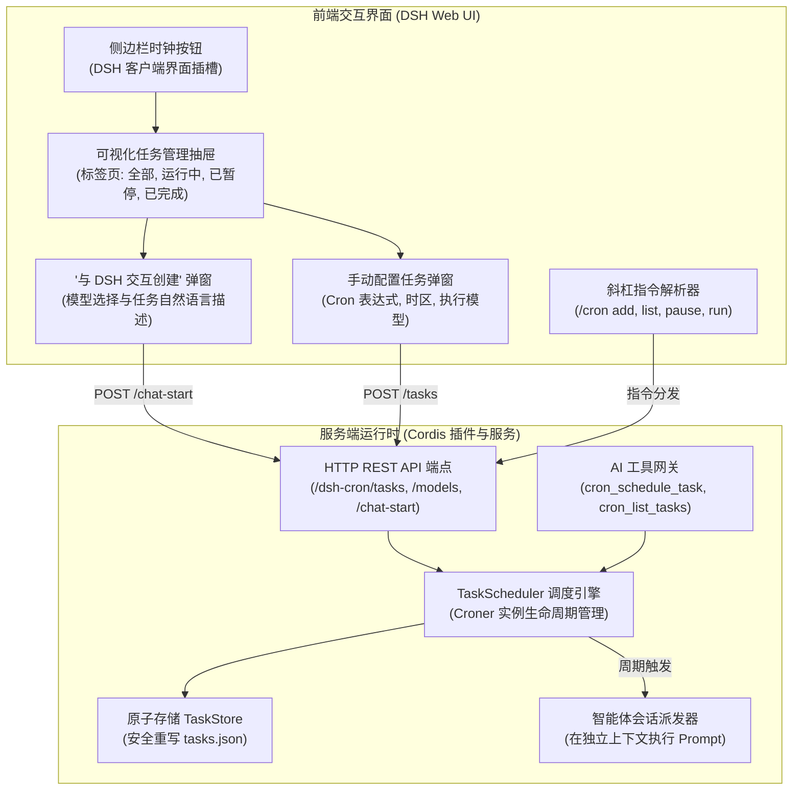

# 📦 @goodandready/dsh-cron

<div align="center">

<h3>面向 DeepSeek Harness 的定时 Cron 调度、后台自动化与智能体任务执行引擎</h3>

<p align="center">
  <a href="https://www.npmjs.com/package/@goodandready/dsh-cron"></a>
  <a href="LICENSE"></a>
  <a href="https://github.com/topics/dsh-plugin"></a>
  <a href="https://nodejs.org"></a>
</p>

<p align="center">
  <a href="https://goodandready.app/"></a>
</p>

<p align="center">
  <a href="../README.md"><b>🇬🇧 English</b></a> •
  <a href="README.ru.md"><b>🇷🇺 Русский</b></a> •
  <a href="README.zh.md"><b>🇨🇳 中文说明</b></a>
</p>

</div>

---

## ⚡ 核心定位与解决痛点

在自主 AI 智能体日常研发与运维工作中，经常需要承担周期性的例行事务：每日早晨生成代码变更简报、定期巡检待处理 PR、监测外部 API 运行健康度，或者定时执行分支清理与自动化测试。在缺乏内置调度器的情况下，开发者通常只能借助外部系统 crontab 脚本、复杂的 Webhook 链路，或者每日人工手动输入指令。

**`@goodandready/dsh-cron`** 是专为 DeepSeek Harness 打造的原生全栈定时调度与后台任务自动化插件。它无缝融合了标准 Cron 表达式、自然语言时间间隔与智能体自主会话执行：

1. **可视化任务管理中心**：集成在 DSH 侧边导航栏的时钟按钮（紧邻看板与聊天），提供全功能任务列表抽屉、状态标签过滤、执行历史与快速动作。
2. **“与 DSH 交互创建”模式**：直接与智能体自然对话，由模型自动梳理需求、配置执行模型并转化为精准的定时任务。
3. **聊天斜杠指令（`/cron`）**：在对话输入框中即可实现全键盘调度管理（`/cron list`, `/cron add`, `/cron pause`, `/cron run`）。
4. **智能体原生工具调用（AI Tool Calling）**：赋予智能体 `cron_schedule_task`、`cron_list_tasks` 等工具，支持模型在对话中自主为后续任务安排执行时间表。
5. **高可靠调度引擎与原子持久化**：基于 `croner` 引擎构建，支持时区配置、友好间隔语法（`every 15m`, `daily`, `weekdays`）、原子写入式 JSON 存储及完整运行审计。

---

## 🏗️ 架构设计



---

## ✨ 核心特性深度解析

### 1. 可视化任务管理中心
点击 DSH 侧边栏的时钟图标即可唤出定时任务全景抽屉：
* **状态过滤标签页**：一键在 **全部 (All)**、**运行中 (Active)**、**已暂停 (Paused)** 和 **已完成 (Completed)** 之间快速切换。
* **快捷操作菜单**：支持即刻手动测试执行（*“立即运行”*）、暂停/恢复调度，以及带有二次确认防误触的安全删除。
* **一键推荐模板**：内置高频工作流预设（*“每日早晨研发简报”*、*“每周代码仓库复盘”*、*“API 探活心跳检测”*）。
* **执行历史记录**：展开任意任务卡片即可查阅过往历次运行时间戳、执行耗时（秒）、完成状态以及智能体生成的完整执行日志。

### 2. “与 DSH 交互创建” 智能配置模式
告别晦涩的手动 Cron 表达式换算：
1. 点击 **新建 ⌄** ➔ **与 DSH 交互创建**。
2. 在下拉框中直观选取本次自动化任务使用的模型服务商与模型名称。
3. 输入任务自然语言意图（例如：*“每个工作日上午 9 点自动扫描仓库中未关闭的 Issue 并汇总至看板”*）。
4. 插件将自动创建专属智能体会话，注入调度器系统指令，协助生成结构化配置并写入持久化存储。

### 3. 聊天斜杠指令 (`/cron`)
极客与键盘流的高效快捷通道：

| 指令 | 语法 | 功能说明 |
|:---|:---|:---|
| `/cron list` | `/cron list` | 列出所有已注册任务的 ID、表达式与当前运行状态 |
| `/cron add` | `/cron add "<时间表>" <提示词>` | 新建任务。示例：`/cron add "every 2h" 检查最新提交并整理日志` |
| `/cron pause` | `/cron pause <id>` | 暂停指定任务的自动触发（保留配置） |
| `/cron resume` | `/cron resume <id>` | 恢复已暂停的任务调度 |
| `/cron run` | `/cron run <id>` | 脱离计划立即触发一次执行 |
| `/cron delete` | `/cron delete <id>` | 从存储中永久注销并删除任务 |

### 4. 智能体原生工具调用 (Tool Calling)
智能体在处理长期复杂项目时，可自主调用调度器工具：

* **`cron_schedule_task`**：注册定时任务，支持传入 `name`、`schedule`、`prompt` 及可选 `model` 覆盖。
* **`cron_list_tasks`**：获取已注册任务列表及下一次预定触发时刻。
* **`cron_toggle_task`**：通过 `id` 快速切换任务的启用/停用状态。

### 5. 支持的时间表达式语法
依托底层 `croner` 引擎，全面兼容标准 5 段/6 段 Cron 语法与易读时间间隔：

* `0 9 * * 1-5` — 工作日早晨 09:00
* `*/15 * * * *` — 每隔 15 分钟
* `0 0 * * 0` — 每周日午夜 00:00
* `every 10m` / `every 2h` / `every 30s` — 自然语言时间间隔
* `daily` / `hourly` / `weekly` — 快捷预设别名

---

## 📦 快速安装

通过 DeepSeek Harness CLI 安装：

```bash
dsh plugin --profile web add @goodandready/dsh-cron
```

重启 DSH 并刷新浏览器工作区。

---

## ⚙️ 配置指南 (`settings.yaml`)

可在 `settings.yaml` 中配置，或在 Web UI 设置面板中调整：

```yaml
# settings.yaml
dsh-cron:
  storagePath: "data/cron-tasks.json"
  maxHistoryEntries: 50
  defaultTimezone: "Asia/Shanghai"
  defaultModel: ""
  notifyOnFailure: true
```

### 配置参数参考表

| 参数名 | 类型 | 默认值 | 功能说明 |
|:---|:---|:---|:---|
| `storagePath` | `string` | `"data/cron-tasks.json"` | 定时任务与运行历史原子持久化文件的存储路径 |
| `maxHistoryEntries` | `number` | `50` | 每个任务卡片保留的最大历史运行记录条数 |
| `defaultTimezone` | `string` | `"UTC"` | 计算 Cron 触发时刻所使用的默认 IANA 时区（如 `"Asia/Shanghai"`） |
| `defaultModel` | `string` | `""` | 未显式指定模型时的全局后备模型标识 |
| `notifyOnFailure` | `boolean` | `true` | 当后台定时任务执行失败时是否在 Web UI 弹出告警徽标 |

---

## 🧪 测试与校验

运行全部自动化单元测试：

```bash
npm test
```

---

## 📄 开源许可证

MIT © [GooDAnDReaDY](https://github.com/GooDAnDReaDY)
