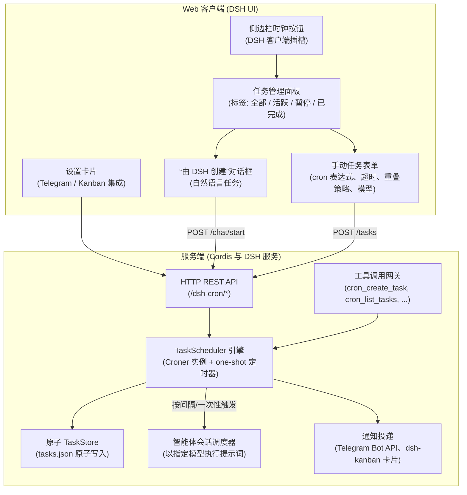

# 📦 @goodandready/dsh-cron

<div align="center">

<h3>面向 DeepSeek Harness 的定时 Cron 调度、后台自动化与智能体任务执行引擎</h3>

<p align="center">
  <a href="https://www.npmjs.com/package/@goodandready/dsh-cron"></a>
  <a href="../LICENSE"></a>
  <a href="https://github.com/topics/dsh-plugin"></a>
  <a href="https://nodejs.org"></a>
</p>

<p align="center">
  <a href="https://goodandready.app/"></a>
</p>

<p align="center">
  <a href="../README.md"><b>🇬🇧 English</b></a> •
  <a href="README.ru.md"><b>🇷🇺 Русский</b></a> •
  <a href="README.zh.md"><b>🇨🇳 中文说明</b></a>
</p>

</div>

---

## ⚡ 概述与问题

自主 AI 智能体经常需要执行周期性任务：生成每日晨报、整理缺陷跟踪、检查 API 健康状态、同步数据库或定期执行 Git 清理。如果 Harness 内没有专用调度器，用户只能依赖外部 crontab 封装、复杂的 webhook 方案或手动干预。

**`@goodandready/dsh-cron`** 是 DeepSeek Harness 的原生全栈调度与后台自动化插件。它将标准 cron 表达式、自然语言间隔语法与自主智能体执行连接起来：

1. **完善的可视化任务管理器** —— 侧边栏按钮与功能齐全的面板：查看、筛选、暂停、立即运行和创建任务。
2. **交互式“由 DSH 创建”流程** —— 与智能体对话，把高层需求转化为规范的定时任务。
3. **自主工具调用** —— 原生 `cron_*` 工具让智能体在会话中自行安排后续执行。
4. **健壮的调度器与原子存储** —— 基于 `croner`：间隔别名、一次性延时任务、原子写入、运行历史与成本追踪。

---

## 🏗️ 架构



---

## ✨ 功能与能力

### 1. 可视化任务管理器
点击 DSH 侧边栏中的时钟图标（位于“新会话”按钮旁）打开管理面板：
* **状态过滤标签**：**全部**、**活跃**、**已暂停**、**已完成**。
* **即时操作**：立即运行（**Run Now**）、暂停/恢复调度、带确认的删除。
* **一键预设模板**：*每日摘要*、*每周回顾*、*待办监控*。
* **运行历史**：打开任务卡片查看历史运行 —— 时间、耗时、状态（成功 / 失败 / 超时 / 跳过 / 错过）、输出与错误。
* **汇总统计栏**：活跃任务数、总运行次数、总 token 消耗与估算美元成本。

### 2. “由 DSH 创建”对话框
无需猜测 cron 语法，用自然语言即可创建任务：
1. 点击 **Create ⌄** ➔ **Create with DSH**。
2. 描述要自动化的内容（例如：*“每个工作日早上 9 点检查未处理的 PR 并起草评论”*）。
3. 插件会创建一个注入了调度器指令的专属智能体会话。智能体会与你确认细节 —— LLM 还是 NO-LLM shell 任务、准确的 cron 表达式、在你的 DSH 安装中可用的经济型模型，以及是否启用“静默规则”（仅在新事件或故障时告警）—— 并在你确认后才通过 `cron_create_task` 工具注册任务。

### 3. 智能体工具（Tool Calling）

| 工具 | 说明 |
|:---|:---|
| `cron_create_task` | 创建任务：`title`、`schedule`、`prompt`，可选 `type`（`llm`/`script`）、`delivery`、`provider`、`model`、`notifyTelegram`、`onlyOnFailure`、`timeoutSeconds`、`overlapPolicy`、`kanbanMode` |
| `cron_schedule_task` | `cron_create_task` 的别名，保持与既有提示词兼容 |
| `cron_list_tasks` | 列出任务的状态、下次运行时间、token 总量与成本估算 |
| `cron_pause_task` | 暂停调度而不删除配置 |
| `cron_resume_task` | 恢复已暂停的调度 |
| `cron_delete_task` | 永久删除任务及其历史 |
| `cron_run_task` | 触发一次立即的带外运行 |

会话中模型可进行的调用示例：

```
cron_create_task({
  "title": "Morning digest",
  "schedule": "0 8 * * 1-5",
  "prompt": "Prepare a brief morning digest of active tasks and open tickets.",
  "type": "llm",
  "delivery": "isolated"
})
```

### 4. 调度表达式语法
基于 `croner`，支持标准 5 段 cron 表达式与友好的别名：

* `0 9 * * 1-5` —— 工作日 09:00
* `*/15 * * * *` —— 每 15 分钟
* `0 0 * * 0` —— 每周日午夜
* `every 10m` / `every 2h` / `every 30s` —— 自然语言间隔
* `daily` / `hourly` / `weekdays` 快捷方式
* **一次性任务**：`at: 2026-09-05T15:00:00Z`（精确 ISO 时间戳）或相对延时 `in 20m` / `in 2h`（也接受 `через 15 минут` 之类的俄语输入）。一次性任务在单次运行后自动转为 `completed`，显示在 **已完成** 标签下。

### 5. Telegram 通知与投递路由
通过与 Telegram Bot API 的直接集成，将执行报告与错误跟踪推送到你的即时通讯工具：

* **自动获取或自定义凭据** —— 在设置对话框中输入自己的 `botToken` 与 `chatId`，或让插件从 DSH `settings.yaml` 的 `dsh-messenger-gateway` 段尽力继承默认值。
* **仅失败时通知** —— 全局或按任务启用 `onlyOnFailure`。成功运行保持静默；失败（`error` 或 `timeout` 状态）会发送带错误跟踪的告警。
* **Markdown 排版** —— 消息包含状态徽标（✅ / ❌）、耗时、调度描述与等宽输出块；动态值会被转义，特殊字符不会破坏消息。
* **测试发送按钮** —— 在安排关键任务前现场验证 Telegram 连通性。

### 6. Kanban 集成与成本统计
* **自动创建 Kanban 卡片** —— 当 `kanbanMode` 为 `on_failure` 或 `always` 时，插件在 `dsh-kanban` 中创建卡片（`on_failure` → `error`/`timeout` 时进入 *Backlog*；`always` → 完成后进入 *Done*/*Backlog*）。
* **Token 与执行成本计量** —— 按运行与任务统计 token 消耗（输入、输出、缓存读取），基于内置价格表估算美元成本，并提供汇总分析栏。

### 7. 重叠策略与执行超时

* **执行超时（`timeoutSeconds`）** —— 达到限制后，shell 子进程通过 abort 信号立即终止，智能体会话被释放以停止消耗 token。默认 `1800`（30 分钟）。
* **重叠策略（`overlapPolicy`）** —— 上一次运行尚未结束时再次触发调度时的行为：
  * **`skip`**（默认）：丢弃重叠的运行，在历史中记录 `skipped`；
  * **`queue`**：将下一次运行排队，当前任务完成后自动开始；
  * **`replace`**：通过 `AbortController` 中止当前运行并启动新的执行。

如果守护进程在计划时刻处于离线状态，启动时该次运行会被记录为 `missed`，历史空档始终可见。

---

## 📦 安装

```bash
dsh plugin --profile web add @goodandready/dsh-cron
```

重启 DeepSeek Harness 实例并刷新浏览器。

---

## ⚙️ 配置（`settings.yaml`）

可以在 `settings.yaml` 中配置，也可以通过 DSH 中的插件设置卡片交互式管理：

```yaml
# settings.yaml
dsh-cron:
  botToken: ""                 # Telegram Bot API 令牌（保密字段）
  chatId: ""                   # 接收报告的 Telegram chat ID
  notifyTelegram: false        # 全局投递所有任务的报告
  onlyOnFailure: false         # 仅失败时投递报告
  kanbanBaseUrl: "http://127.0.0.1:3000"  # dsh-kanban HTTP API 基础地址
```

### 配置参数

| 参数 | 类型 | 默认值 | 说明 |
|:---|:---|:---|:---|
| `botToken` | `string` | `""` | Telegram Bot API 令牌。留空时插件会尽力继承 DSH 设置中 `dsh-messenger-gateway` 配置的机器人。保密字段：界面只显示掩码值 |
| `chatId` | `string` | `""` | 接收报告的 Telegram chat ID。留空时回退到 `dsh-messenger-gateway` 的第一个允许会话 |
| `notifyTelegram` | `boolean` | `false` | 全局开关：向 Telegram 投递运行报告 |
| `onlyOnFailure` | `boolean` | `false` | 全局开关：仅对 `error`/`timeout` 运行投递报告 |
| `kanbanBaseUrl` | `string` | `"http://127.0.0.1:3000"` | 用于自动卡片的 `dsh-kanban` HTTP API 基础地址 |

说明：

* 运行历史上限为**每任务 50 条**（固定）；每条记录最多保留 4000 字符输出。
* 任务在**服务器本地时区**执行；cron 表达式由 `croner` 按主机时钟计算。
* 任务持久化在 DSH 数据目录（`cron/tasks.json`），重启后保留；启动时会检测错过的一次性任务。

---

## 🔌 HTTP API 参考

所有端点由 DSH Web 服务器在 `/dsh-cron/` 下提供。读端点对本地 UI 开放；**变更端点拒绝跨域请求**且请求体最大 1 MB。通过 HTTP 创建 `script` 类型任务还需要 `x-dsh-cron-confirm: script` 请求头 —— 伪造的跨站请求无法附加该头。

| 方法 | 路径 | 说明 |
|:---|:---|:---|
| `GET` | `/dsh-cron/tasks` | 任务列表；查询参数 `status`（`all/active/paused/completed`）、`query`（子串搜索）。返回任务、推荐模板与汇总统计 |
| `POST` | `/dsh-cron/tasks` | 创建或更新任务（携带 `id` 时为更新）。需要 `title`、`schedule`、`prompt` |
| `GET` | `/dsh-cron/tasks/:id/history` | 运行历史，`?limit=20` |
| `POST` | `/dsh-cron/tasks/:id/run` | 立即手动运行 |
| `POST` | `/dsh-cron/tasks/:id/pause` | 暂停调度 |
| `POST` | `/dsh-cron/tasks/:id/resume` | 恢复调度 |
| `POST` | `/dsh-cron/tasks/:id/toggle` | 切换活跃/暂停 |
| `PATCH` | `/dsh-cron/tasks/:id` | 部分更新（仅白名单字段：`title`、`schedule`、`prompt`、`type`、`delivery`、`provider`、`model`、通知/超时/重叠/Kanban 设置、`status`、`oneShot`） |
| `DELETE` | `/dsh-cron/tasks/:id` | 删除任务 |
| `GET` | `/dsh-cron/models` | 列出 LLM 提供方；`?provider=<id>` 列出模型 |
| `POST` | `/dsh-cron/chat/start` | 启动带任务配置指令的“由 DSH 创建”智能体会话 |
| `GET` | `/dsh-cron/settings` | 客户端安全设置（令牌掩码显示） |
| `POST` | `/dsh-cron/settings` | 更新集成设置 |
| `POST` | `/dsh-cron/telegram/test` | 发送 Telegram 测试消息 |
| `POST` | `/dsh-cron/kanban/test` | 创建 Kanban 连通性测试卡片 |
| `*` | `/dsh-cron/action/:id/:action` | 任务操作路由的兼容别名（`run`、`toggle`、`delete`、`history`） |

---

## 🧪 测试

```bash
npm test
```

测试覆盖调度表达式解析、调度器引擎、原子存储、HTTP 辅助函数、通知与工具契约。

---

## 📄 许可证

MIT © [GooDAnDReaDY](https://github.com/GooDAnDReaDY)
