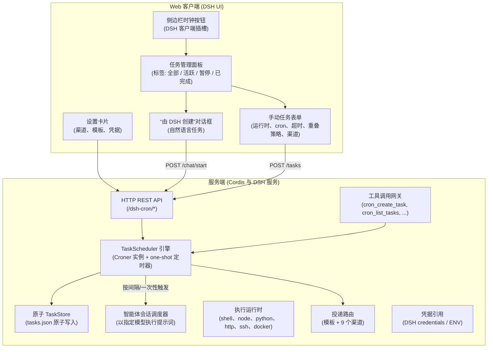

# 📦 @goodandready/dsh-cron

<div align="center">

<h3>面向 DeepSeek Harness 的定时 Cron 调度、后台自动化与智能体任务执行引擎</h3>

<p align="center">
  <a href="https://www.npmjs.com/package/@goodandready/dsh-cron"></a>
  <a href="../LICENSE"></a>
  <a href="https://github.com/topics/dsh-plugin"></a>
  <a href="https://nodejs.org"></a>
</p>

<p align="center">
  <a href="https://goodandready.app/"></a>
</p>

<p align="center">
  <a href="../README.md"><b>🇬🇧 English</b></a> •
  <a href="README.ru.md"><b>🇷🇺 Русский</b></a> •
  <a href="README.zh.md"><b>🇨🇳 中文说明</b></a>
</p>

</div>

---

## ⚡ 概述与问题

自主 AI 智能体经常需要执行周期性任务：生成每日晨报、整理缺陷跟踪、检查 API 健康状态、同步数据库或定期执行 Git 清理。如果 Harness 内没有专用调度器，用户只能依赖外部 crontab 封装、复杂的 webhook 方案或手动干预。

**`@goodandready/dsh-cron`** 是 DeepSeek Harness 的原生全栈调度与后台自动化插件。它将标准 cron 表达式、自然语言间隔语法与自主智能体执行连接起来：

1. **完善的可视化任务管理器** —— 侧边栏按钮带可折叠的活跃任务列表（下次运行时间或实时状态，行数有上限且状态可记忆），以及功能齐全的面板：按类型、模型、渠道筛选，暂停、立即运行、复制、导出/导入与创建任务。
2. **交互式“由 DSH 创建”流程** —— 与智能体对话，把高层需求转化为规范的定时任务。
3. **自主工具调用** —— 原生 `cron_*` 工具让智能体在会话中自行安排后续执行。
4. **健壮的调度器与原子存储** —— 基于 `croner`：间隔别名、一次性延时任务、原子写入、运行历史与成本追踪。
5. **六种执行运行时** —— shell、Node.js、Python、HTTP/webhook、远程 SSH 与 Docker，并支持按任务的环境变量、工作区绑定以及面向代码修改任务的隔离 git worktree。
6. **多渠道路由与模板** —— 一次运行可投递到 Telegram、dsh-kanban、Discord、Slack、ntfy、Bark、PushPlus、语音（`dsh-tts`）与 Gitea，支持 `{变量}` 消息模板与按 DSH 凭据名称引用的密钥。

---

## 🏗️ 架构



---

## ✨ 功能与能力

### 1. 可视化任务管理器
点击 DSH 侧边栏中的时钟图标（位于“新会话”按钮旁）打开管理面板：
* **状态过滤标签**：**全部**、**活跃**、**已暂停**、**已完成**。
* **即时操作**：立即运行（**Run Now**）、暂停/恢复调度、带确认的删除。
* **一键预设模板**：*每日摘要*、*每周回顾*、*待办监控*。
* **运行历史**：打开任务卡片查看历史运行 —— 时间、耗时、状态（成功 / 失败 / 超时 / 跳过 / 错过）、输出与错误。
* **汇总统计栏**：活跃任务数、总运行次数、总 token 消耗与估算美元成本。

### 2. “由 DSH 创建”对话框
无需猜测 cron 语法，用自然语言即可创建任务：
1. 点击 **Create ⌄** ➔ **Create with DSH**。
2. 描述要自动化的内容（例如：*“每个工作日早上 9 点检查未处理的 PR 并起草评论”*）。
3. 插件会创建一个注入了调度器指令的专属智能体会话。智能体会与你确认细节 —— LLM 还是 NO-LLM shell 任务、准确的 cron 表达式、在你的 DSH 安装中可用的经济型模型，以及是否启用“静默规则”（仅在新事件或故障时告警）—— 并在你确认后才通过 `cron_create_task` 工具注册任务。

### 3. 智能体工具（Tool Calling）

| 工具 | 说明 |
|:---|:---|
| `cron_create_task` | 创建任务：`title`、`schedule`、`prompt`、`fallbackModel`（失败时改用更强模型重试一次），可选 `type`（`llm`/`script`/`node`/`python`/`http`/`ssh`/`docker`/`skill`/`workflow`）、`delivery`、`provider`、`model`、`channels`、`template`、`notifyTelegram`、`onlyOnFailure`、`timeoutSeconds`、`overlapPolicy`、`kanbanMode` |
| `cron_schedule_task` | `cron_create_task` 的别名，保持与既有提示词兼容 |
| `cron_list_tasks` | 列出任务的状态、下次运行时间、token 总量与成本估算 |
| `cron_pause_task` | 暂停调度而不删除配置 |
| `cron_resume_task` | 恢复已暂停的调度 |
| `cron_delete_task` | 永久删除任务及其历史 |
| `cron_run_task` | 触发一次立即的带外运行 |
| `cron_get_task` | 读取单个任务的完整配置，包括列表中看不到的字段 |
| `cron_update_task` | 就地修改现有任务（白名单字段，校验与 HTTP 路由一致）；提示模型先与用户确认会执行代码的改动 |

会话中模型可进行的调用示例：

```
cron_create_task({
  "title": "Morning digest",
  "schedule": "0 8 * * 1-5",
  "prompt": "Prepare a brief morning digest of active tasks and open tickets.",
  "type": "llm",
  "delivery": "isolated"
})
```

### 4. 调度表达式语法
基于 `croner`，支持标准 5 段 cron 表达式与友好的别名：

* `0 9 * * 1-5` —— 工作日 09:00
* `*/15 * * * *` —— 每 15 分钟
* `0 0 * * 0` —— 每周日午夜
* `every 10m` / `every 2h` / `every 30s` —— 自然语言间隔
* `daily` / `hourly` / `weekdays` 快捷方式，以及标准 `@hourly` / `@daily` / `@weekly` / `@monthly` / `@yearly` 与 `@every 30m`
* **任务级时区** —— 可为任务设置 IANA 时区（如 `Europe/Berlin`）；未设置时按服务器本地时间调度
* **一次性任务**：`at: 2026-09-05T15:00:00Z`（精确 ISO 时间戳）或相对延时 `in 20m` / `in 2h`（也接受 `через 15 минут` 之类的俄语输入）。一次性任务在单次运行后自动转为 `completed`，显示在 **已完成** 标签下。

### 5. 执行可靠性
* **自动重试** —— 按任务设置 `maxRetries` 与基础 `retryBackoffMs`：失败（`error`/`timeout`）的运行按指数退避自动重试，成功后计数归零。
* **Misfire 策略** —— 选择守护进程离线期间错过的运行如何处理：`skip`（默认 —— 记录缺口）、`runOnce`（迟执行一次）或 `catchUpAll`（迟执行并记录缺口）。`skip` 下错过的一次性任务直接转为 `completed`，不再过期触发。
* **并发上限** —— 插件设置 `maxConcurrent` 限制并行运行数；超出的运行记录为 `skipped` 并附原因。
* **实时执行指示** —— 任务列表中的脉冲状态图标与运行计时器。

### 6. 执行运行时
每个任务可选择自己的运行时；非 LLM 运行时不需要模型，也不消耗 token：

* **Shell**（`script`）—— 通过 Harness shell 执行命令或脚本，支持 `env` 与 `cwd`。
* **Node.js**（`node`）与 **Python**（`python`）—— 指定解释器（`nodePath`、`pythonPath`）运行片段；Python 会自动识别项目虚拟环境。
* **HTTP**（`http`）—— 以自定义请求头与请求体访问 URL，状态码与响应写入运行历史。
* **SSH**（`ssh`）—— 通过 `dsh-remote-workspace` 配置（`sshProfileId`）或独立 host/key 字段在远程主机执行命令。
* **Docker**（`docker`）—— 在镜像容器（`dockerImage`）中执行命令。
* **环境变量** —— 按任务的 `env` 映射（界面中每行 KEY VALUE）应用于外部运行时；请勿在此存放密钥。
* **工作区与 worktree** —— 将任务绑定到 Harness 工作区（`workspaceId`）；对会修改代码的智能体任务，可在隔离的 git worktree 中运行（`worktree`、`keepWorktree`）。

### 7. 成本控制：回退模型
任务可以默认使用便宜模型，失败时改用更强模型完成：设置 `fallbackModel`（可选 `fallbackProvider`），失败（`error` 或 `timeout`）的运行会在该模型上重试一次，之后才进入常规重试退避。历史记录会标明最终产出结果的模型以及是否使用了回退，两次尝试的用量与成本都会累计，模板变量 `{model}` 渲染完成运行的模型。回退仅适用于智能体类型（`llm`、`skill`、`workflow`）。

### 8. 会话集成与权限
* **按任务的权限预设** —— `default`、`read-only`、`workspace-write` 或 `full` 在提示词执行前应用于任务会话。
* **会话自动归档** —— 隔离的 cron 会话在运行后自动归档（尽力而为），不干扰聊天列表。
* **历史 → 会话** —— 每次 LLM 运行都会记录会话，可直接从历史记录打开对话。

### 9. 按规则保持安静
有输出的任务可以设置用自然语言描述的**静默规则**（例如“当没有分区使用率超过 80% 时保持安静”）。运行成功时，由便宜模型对照该规则判断输出，若结论为保持安静则跳过报告，并在运行历史中记录原因。遵循 fail-open：没有规则、没有模型、调用失败或答案无法解析时都会照常投递报告。插件设置 `silentRuleModel` 指定用于判断的模型。

### 10. 失败诊断
智能体任务可以请求诊断：设置 `inspectOnFailure` 后，失败（`error` 或 `timeout`）的运行会连同任务提示词与截断输出一起交给模型，运行历史中会保存简短诊断与具体的提示词修改建议。历史记录提供按钮把该建议载入编辑表单 —— 不会自动应用。模型由 `inspectorModel` 指定，消息模板中可使用 `{diagnosis}`。模型不可用或调用失败时，失败的运行保持原样。

### 11. 通知渠道与消息模板
运行完成后，报告会发送到该任务配置的所有渠道 —— Telegram、dsh-kanban、Discord、Slack、ntfy、Bark、PushPlus、语音（`dsh-tts`）以及 Gitea issue：

* **任务迁移** —— 将全部配置导出为版本化 JSON，并在别处导入（含预览摘要）；导入的任务处于暂停状态。
* **按任务选择渠道** —— 在任务表单中勾选渠道；显式选择会覆盖旧版 `notifyTelegram`/`kanbanMode` 开关，留空则回退到它们。
* **故障隔离** —— 某个渠道不可用会记录在调度器日志中，其余渠道仍会收到报告；失效的 webhook 不会吞掉整份报告。
* **消息模板** —— 支持全局模板、按渠道覆盖或按任务模板，变量为 `{title} {id} {status} {output} {error} {duration} {schedule} {time} {tokens} {cost}`。未知占位符保持原样，失败运行默认使用失败模板。
* **`onlyOnFailure`** —— 全局或按任务生效：成功运行静默，仅发送 `error`/`timeout`。
* **凭据按名称引用** —— webhook token 与 Telegram bot token 填写 DSH 凭据的名称（`botTokenRef`、`ntfyTokenRef`、`pushplusTokenRef`、`giteaTokenRef`），发送时通过 DSH credentials 服务解析，并可回退到环境变量，且绝不会经过插件设置。webhook URL 与 Bark 设备键本身内嵌密钥，因此保存在插件设置文件中，但返回浏览器时始终为掩码，界面回传的掩码值也不会覆盖已保存的值。
* **投递超时** —— 每个渠道请求都有上限（`deliveryTimeoutMs`，默认 15000 毫秒，可在设置面板或 `settings.yaml` 中调整），且各渠道并发发送：无响应的端点只记录为失败，不会拖慢其他渠道或下一次调度。限制作用于整个渠道处理过程，也覆盖凭据解析——它不支持 abort 信号。
* **Telegram** —— 带状态徽标（✅ / ❌）、耗时、调度描述与等宽输出块的 Markdown 报告；动态值会被转义。凭据可直接填写，或从 DSH `settings.yaml` 的 `dsh-messenger-gateway` 段继承（尽力而为）。
* **Discord / Slack** —— 通过 webhook 投递：Discord 使用按运行状态着色的 embed，Slack 使用纯文本正文。
* **ntfy / Bark / PushPlus** —— 移动推送，支持主题/设备键与可选 bearer token；Bark 的标题与正文放在请求路径中，PushPlus 端点可指向自建代理。
* **语音** —— `dsh-tts` 通过其 HTTP 路由朗读报告（`ttsBaseUrl`，默认 `http://127.0.0.1:3080`）。
* **Gitea** —— 创建包含运行报告的 issue（`giteaBaseUrl`、`giteaRepo`、token 凭据）；失败运行标记为 `cron`、`bug`、`alert`。
* **测试发送按钮** —— 在安排关键任务前现场验证 Telegram 连通性。

### 12. Kanban 集成与成本统计
* **自动创建 Kanban 卡片** —— 当 `kanbanMode` 为 `on_failure` 或 `always` 时，插件在 `dsh-kanban` 中创建卡片（`on_failure` → `error`/`timeout` 时进入 *Backlog*；`always` → 完成后进入 *Done*/*Backlog*）。
* **Token 与执行成本计量** —— 按运行与任务统计 token 消耗（输入、输出、缓存读取），基于内置价格表估算美元成本，并提供汇总分析栏。

### 13. 重叠策略与执行超时

* **执行超时（`timeoutSeconds`）** —— 达到限制后，shell 子进程通过 abort 信号立即终止，智能体会话被释放以停止消耗 token。默认 `1800`（30 分钟）。
* **重叠策略（`overlapPolicy`）** —— 上一次运行尚未结束时再次触发调度时的行为：
  * **`skip`**（默认）：丢弃重叠的运行，在历史中记录 `skipped`；
  * **`queue`**：将下一次运行排队，当前任务完成后自动开始；
  * **`replace`**：通过 `AbortController` 中止当前运行并启动新的执行。

如果守护进程在计划时刻处于离线状态，启动时该次运行会被记录为 `missed`，历史空档始终可见。

### 14. 心跳监控（Dead man's switch）
* 在插件设置中配置 `heartbeatUrl` 与 `heartbeatIntervalSec`，调度器会按间隔 GET 该地址 —— 外部监控可在心跳停止时告警。
* 内置 `GET /dsh-cron/heartbeat` 端点返回存活状态、活跃任务数与最近运行时间，便于自建看门狗。

---

## 📦 安装

```bash
dsh plugin --profile web add @goodandready/dsh-cron
```

重启 DeepSeek Harness 实例并刷新浏览器。

---

## ⚙️ 配置（`settings.yaml`）

可以在 `settings.yaml` 中配置，也可以通过 DSH 中的插件设置卡片交互式管理：

```yaml
# settings.yaml
dsh-cron:
  botToken: ""                 # Telegram Bot API 令牌（保密字段）
  chatId: ""                   # 接收报告的 Telegram chat ID
  notifyTelegram: false        # 全局投递所有任务的报告
  onlyOnFailure: false         # 仅失败时投递报告
  kanbanBaseUrl: "http://127.0.0.1:3000"  # dsh-kanban HTTP API 基础地址
  defaultTimezone: ""          # 默认 IANA 时区（空 = 服务器本地）
  maxConcurrent: 0             # 最大并行运行数（0 = 不限）
  heartbeatUrl: ""             # 心跳上报 URL（dead man's snitch）
  heartbeatIntervalSec: 0      # 心跳间隔秒数（0 = 关闭）
  # --- 投递渠道 ---
  botTokenRef: ""              # Telegram bot token 的凭据名称
  template: ""                 # 全局消息模板，例如 "⏰ {title} — {status}"
  channelTemplates: {}         # 按渠道覆盖模板
  deliveryTimeoutMs: 15000     # 每个渠道的投递超时；慢端点记为失败，不影响其他渠道
  discordWebhookUrl: ""        # Discord webhook
  slackWebhookUrl: ""          # Slack incoming webhook
  ntfyUrl: "https://ntfy.sh"   # ntfy 服务器；ntfyTopic / ntfyTokenRef
  ntfyTopic: ""
  ntfyTokenRef: ""
  barkServerUrl: "https://api.day.app"  # Bark 服务器；barkKey = 设备键
  barkKey: ""
  pushplusUrl: "https://www.pushplus.plus/send"  # pushplusTokenRef
  pushplusTokenRef: ""
  ttsBaseUrl: "http://127.0.0.1:3080"   # dsh-tts 基础地址
  giteaBaseUrl: ""             # giteaRepo = owner/repo，giteaTokenRef = 凭据名称
  giteaRepo: ""
  giteaTokenRef: ""
```

### 配置参数

| 参数 | 类型 | 默认值 | 说明 |
|:---|:---|:---|:---|
| `botToken` | `string` | `""` | Telegram Bot API 令牌。留空时插件会尽力继承 DSH 设置中 `dsh-messenger-gateway` 配置的机器人。保密字段：界面只显示掩码值 |
| `chatId` | `string` | `""` | 接收报告的 Telegram chat ID。留空时回退到 `dsh-messenger-gateway` 的第一个允许会话 |
| `notifyTelegram` | `boolean` | `false` | 全局开关：向 Telegram 投递运行报告 |
| `onlyOnFailure` | `boolean` | `false` | 全局开关：仅对 `error`/`timeout` 运行投递报告 |
| `kanbanBaseUrl` | `string` | `"http://127.0.0.1:3000"` | 用于自动卡片的 `dsh-kanban` HTTP API 基础地址 |
| `defaultTimezone` | `string` | `""` | 任务调度的默认 IANA 时区；空 = 服务器本地时间 |
| `maxConcurrent` | `number` | `0` | 并行运行上限；超出的运行记录为 `skipped`（0 = 不限） |
| `heartbeatUrl` | `string` | `""` | 心跳上报 URL，调度器存活期间按 `heartbeatIntervalSec` 间隔 GET |
| `heartbeatIntervalSec` | `number` | `0` | 心跳间隔秒数（0 = 关闭） |
| `botTokenRef` | `string` | `""` | 保存 Telegram bot token 的 DSH 凭据名称；发送时解析（回退顺序：`botToken` → messenger-gateway 设置 → 环境变量 `CRON_TELEGRAM_BOT_TOKEN`） |
| `template` | `string` | `""` | 带 `{title}`/`{status}`/`{duration}` 等占位符的全局消息模板；留空使用内置文本 |
| `channelTemplates` | `object` | `{}` | 按渠道 ID 覆盖模板（`telegram`、`discord` 等） |
| `deliveryTimeoutMs` | `number` | `15000` | 每个渠道的投递超时；超时的端点记为失败，不拖慢其他渠道或下一次调度 |
| `discordWebhookUrl` / `slackWebhookUrl` | `string` | `""` | Discord 与 Slack 渠道的 webhook 地址 |
| `ntfyUrl` / `ntfyTopic` / `ntfyTokenRef` | `string` | `"https://ntfy.sh"` / `""` / `""` | ntfy 服务器、主题与可选的 token 凭据名称（以 `Authorization: Bearer …` 发送） |
| `barkServerUrl` / `barkKey` | `string` | `"https://api.day.app"` / `""` | Bark 服务器与设备键（键、标题和正文位于请求路径中） |
| `pushplusUrl` / `pushplusTokenRef` | `string` | `"https://www.pushplus.plus/send"` / `""` | PushPlus 端点（可指向自建代理）与 token 凭据名称 |
| `ttsBaseUrl` | `string` | `"http://127.0.0.1:3080"` | 用于语音播报的 `dsh-tts` 基础地址 |
| `giteaBaseUrl` / `giteaRepo` / `giteaTokenRef` | `string` | `""` | Gitea 渠道：基础地址、`owner/repo` 与 API token 的凭据名称 |

说明：

* 运行历史上限为**每任务 50 条**（固定）；每条记录最多保留 4000 字符输出。
* 任务在**服务器本地时区**执行；cron 表达式由 `croner` 按主机时钟计算。
* 任务持久化在 DSH 数据目录（`cron/tasks.json`），重启后保留；启动时会检测错过的一次性任务。

---

## 🔌 HTTP API 参考

所有端点由 DSH Web 服务器在 `/dsh-cron/` 下提供。读端点对本地 UI 开放；**变更端点拒绝跨域请求**且请求体最大 1 MB。通过 HTTP 创建 `script` 类型任务还需要 `x-dsh-cron-confirm: script` 请求头 —— 伪造的跨站请求无法附加该头。

| 方法 | 路径 | 说明 |
|:---|:---|:---|
| `GET` | `/dsh-cron/tasks` | 任务列表；查询参数 `status`（`all/active/paused/completed`）、`query`（子串搜索）。返回任务、推荐模板与汇总统计 |
| `POST` | `/dsh-cron/tasks` | 创建或更新任务（携带 `id` 时为更新）。需要 `title`、`schedule`、`prompt` |
| `GET` | `/dsh-cron/tasks/:id/history` | 运行历史，`?limit=20` |
| `POST` | `/dsh-cron/tasks/:id/run` | 立即手动运行 |
| `POST` | `/dsh-cron/tasks/:id/pause` | 暂停调度 |
| `POST` | `/dsh-cron/tasks/:id/resume` | 恢复调度 |
| `POST` | `/dsh-cron/tasks/:id/toggle` | 切换活跃/暂停 |
| `POST` | `/dsh-cron/tasks/:id/duplicate` | 创建暂停状态的副本：复制配置，重置运行历史与计数 |
| `GET` | `/dsh-cron/recipes` | 内置配方目录：按类别分组的现成监控预设，全部为只读操作 |
| `GET` | `/dsh-cron/tasks/export` | 仅含任务配置的版本化 JSON —— 不含历史与计数。渠道按名称引用凭据，但手动填写在任务中的 `env` 与 HTTP 请求头属于配置，会出现在文件里 |
| `POST` | `/dsh-cron/tasks/import` | 校验文档并以 `add`、`replace` 或 `skip` 策略导入；支持 `dryRun` 预览。导入的任务始终为**暂停**状态，恢复不会自动触发 |
| `PATCH` | `/dsh-cron/tasks/:id` | 部分更新（仅白名单字段：`title`、`schedule`、`prompt`、`type`、`delivery`、`provider`、`model`、通知/超时/重叠/Kanban 设置、`status`、`oneShot`） |
| `DELETE` | `/dsh-cron/tasks/:id` | 删除任务 |
| `GET` | `/dsh-cron/models` | 列出 LLM 提供方；`?provider=<id>` 列出模型 |
| `POST` | `/dsh-cron/chat/start` | 启动带任务配置指令的“由 DSH 创建”智能体会话 |
| `GET` | `/dsh-cron/settings` | 客户端安全设置（令牌掩码显示） |
| `POST` | `/dsh-cron/settings` | 更新集成设置（通过设置服务应用） |
| `GET` | `/dsh-cron/heartbeat` | 存活探针：活跃任务数与最近运行时间 |
| `POST` | `/dsh-cron/telegram/test` | 发送 Telegram 测试消息 |
| `POST` | `/dsh-cron/kanban/test` | 创建 Kanban 连通性测试卡片 |
| `*` | `/dsh-cron/action/:id/:action` | 任务操作路由的兼容别名（`run`、`toggle`、`delete`、`history`） |

---

## 🧪 测试

```bash
npm test
```

测试覆盖调度表达式解析、调度器引擎、原子存储、HTTP 辅助函数、通知与工具契约。

---

## 📄 许可证

MIT © [GooDAnDReaDY](https://github.com/GooDAnDReaDY)
